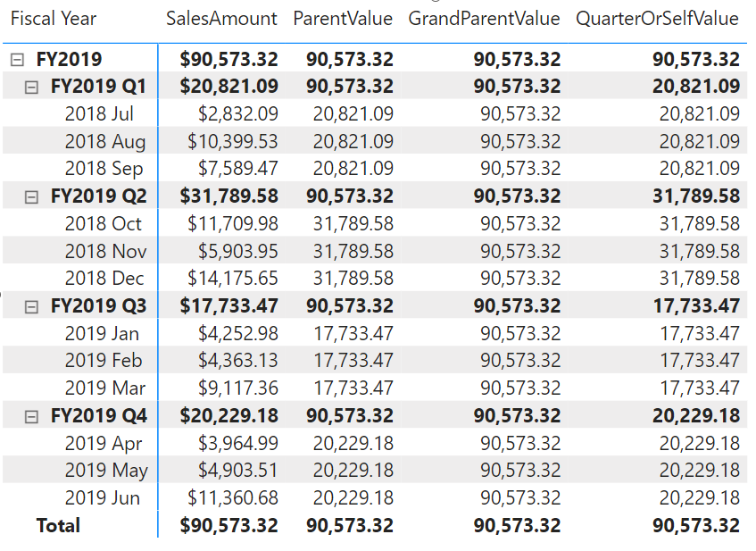

# COLLAPSE

Retrieves a context at a higher level compared to the current context. If an expression is provided, returns its value in the new context, allowing for navigation in hierarchies and calculation at a higher level.

## Syntax

The syntaxes that perform both navigation and calculation.
```dax
COLLAPSE ( <expression>, <axis>[, N] )
COLLAPSE ( <expression>, <column>[, <column>] ... )
```

The syntaxes that perform navigation only.
```dax
COLLAPSE ( <axis>[, N] )
COLLAPSE ( <column>[, <column>] ... )
```

### Parameters

|Term|Definition|
|--------|--------------|
|expression|The expression to be evaluated in the new context.|
|axis|An axis reference.|
|column|A column in the data grid.|
|N|(Optional) The number of levels to collapse. If omitted, the default value is 1.|

## Return value

For versions that perform both navigation and calculation, the function returns the value of the expression in the new context after navigating to a new level.
For versions that perform navigation only, the function modifies the evaluation context by navigating to a new level.

## Remarks

* This function can be used only in visual calculations.
* The navigation-only versions of the function can be used inside the CALCULATE function.
* The levels of the hierarchy are determined by all columns in each axis referenced by the axis reference.
* When columns are specified, the axes are determined by including each column's axis the first time it is encountered.
* When N is specified, the function navigates up the hierarchy N levels from the current level or the topmost level, whichever comes first.
* When multiple columns are specified, the function navigates up the hierarchy until it reaches the first level at which none of the specified columns is present.
* Navigation begins at the current cell in the data matrix, ascending up the hierarchy. If a specified column is at a level lower than the current cell, it will be disregarded.

## Example

Given a table that summarizes the total sales for a hierarchy with levels for total, year, quarter and month, the following DAX calculations fetch the value of [SalesAmount] at the parent level, the grandparent level, and the year or self level, respectively.

```dax
ParentValue = COLLAPSE([SalesAmount], ROWS)
GrandParentValue = COLLAPSE([SalesAmount], ROWS, 2)
YearOrSelfValue = COLLAPSE([SalesAmount], [Month])
```

The screenshot below shows the matrix with the three visual calculations.



## See also

[EXPAND](expand-function-dax.md)
[EXPANDALL](expandall-function-dax.md)
[COLLAPSEALL](collapseall-function-dax.md)


