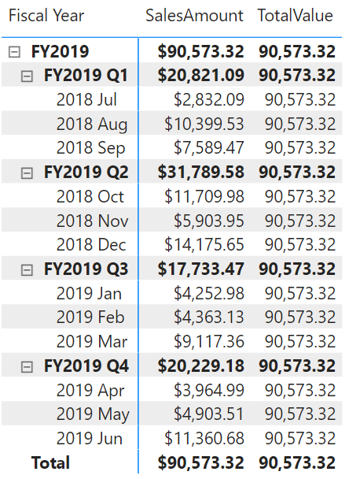

# COLLAPSEALL

Retrieves a context at the highest level compared to the current context. If an expression is provided, returns its value in the new context, allowing for navigation in hierarchies and calculation at the highest level.

## Syntax

The syntax that performs both navigation and calculation.
```dax
COLLAPSEALL ( <expression>, <axis> )
```

The syntax that performs navigation only.
```dax
COLLAPSEALL ( <axis> )
```

### Parameters

|Term|Definition|
|--------|--------------|
|expression|The expression to be evaluated in the new context.|
|axis|An axis reference.|

## Return value

For the version that performs both navigation and calculation, the function returns the value of the expression in the new context after navigating to the highest level.
For the version that performs navigation only, the function modifies the evaluation context by navigating to the highest level.

## Remarks

* This function can be used only in visual calculations.
* The navigation-only versions of the function can be used inside the CALCULATE function.
* The levels of the hierarchy are determined by all columns in each axis referenced by the axis reference.

## Example

Given a table that summarizes the total sales for a hierarchy with levels for total, year, quarter and month, the following DAX calculation fetches the value of [SalesAmount] at the highest level, total.

```dax
TotalValue = COLLAPSEALL([SalesAmount], ROWS)
```

The screenshot below shows the matrix with the visual calculation.



## See also

[EXPAND](expand-function-dax.md)
[EXPANDALL](expandall-function-dax.md)
[COLLAPSE](collapse-function-dax.md)


