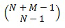

# COMBINA Function (DAX)
Returns the number of combinations (with repetitions) for a given number of items.  
  
## Syntax  
  
```dax
COMBINA(number, number_chosen)  
```
  
#### Parameters  
  
|Term|Definition|  
|--------|--------------|  
|number|Must be greater than or equal to 0, and greater than or equal to Number_chosen. Non-integer values are truncated.|  
|number_chosen|Must be greater than or equal to 0. Non-integer values are truncated.|  
  
## Return Value  
Returns the number of combinations (with repetitions) for a given number of items.  
  
## Remarks  
If the value of either argument is outside of its constraints, COMBINA returns the #NUM! error value.  
  
If either argument is a non-numeric value, COMBINA returns the #VALUE! error value.  
  
The following equation is used, where N is Number and M is Number_chosen:  
  
  
  
## Example  
  
|Formula|Description|Result|  
|-----------|---------------|----------|  
|=COMBINA(4,3)|Returns the number of combinations (with repetitions) for 4 and 3.|20|  
|=COMBINA(10,3)|Returns the number of combinations (with repetitions) for 10 and 3.|220|  
  
