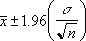

# CONFIDENCE.NORM Function (DAX)
The confidence interval is a range of values. Your sample mean, x, is at the center of this range and the range is x ± CONFIDENCE.NORM. For example, if x is the sample mean of delivery times for products ordered through the mail, x ± CONFIDENCE.NORM is a range of population means. For any population mean, μ0, in this range, the probability of obtaining a sample mean further from μ0 than x is greater than alpha; for any population mean, μ0, not in this range, the probability of obtaining a sample mean further from μ0 than x is less than alpha. In other words, assume that we use x, standard_dev, and size to construct a two-tailed test at significance level alpha of the hypothesis that the population mean is μ0. Then we will not reject that hypothesis if μ0 is in the confidence interval and will reject that hypothesis if μ0 is not in the confidence interval. The confidence interval does not allow us to infer that there is probability 1 – alpha that our next package will take a delivery time that is in the confidence interval.  
  
## Syntax  
  
```  
CONFIDENCE.NORM(alpha,standard_dev,size)  
```  
  
#### Parameters  
  
|Term|Definition|  
|--------|--------------|  
|alpha|The significance level used to compute the confidence level. The confidence level equals 100*(1 - alpha)%, or in other words, an alpha of 0.05 indicates a 95 percent confidence level.|  
|standard_dev|The population standard deviation for the data range and is assumed to be known.|  
|standard_dev,size|The sample size.|  
  
## Return Value  
A range of values  
  
## Remarks  
If any argument is nonnumeric, CONFIDENCE.NORM returns the #VALUE! error value.  
  
If alpha ≤ 0 or alpha ≥ 1, CONFIDENCE.NORM returns the #NUM! error value.  
  
If standard_dev ≤ 0, CONFIDENCE.NORM returns the #NUM! error value.  
  
If size is not an integer, it is rounded.  
  
If size &lt; 1, CONFIDENCE.NORM returns the #NUM! error value.  
  
If we assume alpha equals 0.05, we need to calculate the area under the standard normal curve that equals (1 - alpha), or 95 percent. This value is ± 1.96. The confidence interval is therefore:  
  
  
  
