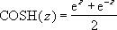

# COSH Function (DAX)
Returns the hyperbolic cosine of a number.  
  
## Syntax  
  
```dax
COSH(number)  
```
  
#### Parameters  
  
|Term|Definition|  
|--------|--------------|  
|number|Required. Any real number for which you want to find the hyperbolic cosine.|  
  
## Return value  
The hyperbolic cosine of a number.  
  
## Remarks  
The formula for the hyperbolic cosine is:  
  
  
  
## Example  
  
|Formula|Description|Result|  
|-----------|---------------|----------|  
|=COSH(4)|Hyperbolic cosine of 4|27.308233|  
|=COSH(EXP(1))|Hyperbolic cosine of the base of the natural logarithm.|7.6101251|  
  
