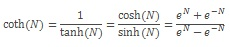

# COTH

Returns the hyperbolic cotangent of a hyperbolic angle.
  
## Syntax  
  
```dax
COTH (<number>)
```
  
### Parameters
  
|Term|Definition|  
|--------|--------------|  
|number|The hyperbolic angle in radians for which you want the hyperbolic cotangent.|  
  
## Return value

The hyperbolic cotangent of the given angle.  
  
## Remarks

- The hyperbolic cotangent is an analog of the ordinary (circular) cotangent.

- The absolute value of number must be less than 2^27 and cannot be 0.

- If number is outside its constraints, an error is returned

- If number is a non-numeric value, an error is returned.

- The following equation is used:
  
  

## Example  
  
The following DAX query,
  
```dax
EVALUATE { COTH(2) }
```

Returns

|[Value] |
|---------|
|1.03731472072755   |
