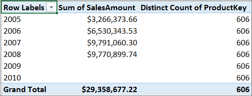

# CROSSFILTER Function
Specifies the cross-filtering direction to be used in a calculation for a relationship that exists between two columns.  
  
## Syntax  
  
```  
CROSSFILTER(<columnName1>, <columnName2>, <direction>)  
```  
  
#### Parameters  
  
|Term|Definition|  
|--------|--------------|  
|columnName1|The name of an existing column, using standard DAX syntax and fully qualified, that usually represents the many side of the relationship to be used; if the arguments are given in reverse order the function will swap them before using them. This argument cannot be an expression.|  
|columnName2|The name of an existing column, using standard DAX syntax and fully qualified, that usually represents the one side or lookup side of the relationship to be used; if the arguments are given in reverse order the function will swap them before using them. This argument cannot be an expression.|  
|Direction|The cross-filter direction to be used. Must be one of the following:<br />none<br />No cross-filtering occurs along this relationship<br /><br />**one** - Filters on the one or lookup side of the side of the relationship filter the many side.<br /><br />**both** - <br />Filters on either side filter the other<br /><br />**none** - No cross-filtering occurs along this relationship|  
  
## Return Value  
The function returns no value; the function only sets the cross-filtering direction for the indicated relationship, for the duration of the query.  
  
## Remarks  
  
-   In the case of a 1:1 relationship, there is no difference between the one and both direction.  
  
-   CROSSFILTER can only be used in functions that take a filter as an argument, for example: CALCULATE, CALCULATETABLE, CLOSINGBALANCEMONTH, CLOSINGBALANCEQUARTER, CLOSINGBALANCEYEAR, OPENINGBALANCEMONTH, OPENINGBALANCEQUARTER, OPENINGBALANCEYEAR, TOTALMTD, TOTALQTD and TOTALYTD functions.  
  
-   CROSSFILTER uses existing relationships in the model, identifying relationships by their ending point columns.  
  
-   In CROSSFILTER, the cross-filtering setting of a relationship is not important; that is, whether the relationship is set to filter one, or both directions in the model does not affect the usage of the function. CROSSFILTER will override any existing cross-filtering setting.  
  
-   An error is returned if any of the columns named as an argument is not part of a relationship or the arguments belong to different relationships.  
  
-   If CALCULATE expressions are nested, and more than one CALCULATE expression contains a CROSSFILTER function, then the innermost CROSSFILTER is the one that prevails in case of a conflict or ambiguity.  
  
## Example  
In the following model diagram, both DimProduct and DimDate have a single direction relationship with FactOnlineSales.  
  
  
  
By default, we cannot get the Count of Products sold by year:  
  
  
  
There are  two ways to get the count of products by year:  
  
-   Turn on bi-directional cross-filtering on the relationship. This will change how filters work for all data between these two tables.  
  
-   Use the CROSSFILTER function to change how the relationships work for just this measure.  
  
When using DAX, we can use the CROSSFILTER function to change how the cross-filter direction behaves between two columns defined by a relationship. In this case, the DAX expression looks like this:  
  
**BiDi:= CALCULATE([Distinct Count of ProductKey], CROSSFILTER(FactInternetSales[ProductKey], DimProduct[ProductKey] , Both))**  
  
By using the CROSSFILTER function in our measure expression, we get the expected results.  
  
  
  
