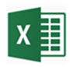
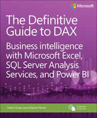

# DAX overview

Data Analysis Expressions (DAX) is a formula expression language used in Analysis Services, Power BI, and Power Pivot in Excel. DAX formulas include functions, operators, and values to perform advanced calculations and queries on data in related tables and columns in tabular data models.

This article provides only a basic introduction to the most important concepts in DAX. It describes DAX as it applies to all the products that use it. Some functionality may not apply to certain products or use cases. Refer to your product's documentation describing its particular implementation of DAX.

## Calculations

DAX formulas are used in measures, calculated columns, calculated tables, and row-level security.  

### Measures  

Measures are dynamic calculation formulas where the results change depending on context. Measures are used in reporting that support combining and filtering model data by using multiple attributes such as a Power BI report or Excel PivotTable or PivotChart. Measures are created by using the DAX formula bar in the model designer.  
  
A formula in a measure can use standard aggregation functions automatically created by using the Autosum feature, such as COUNT or SUM, or you can define your own formula by using the DAX formula bar. Named measures can be passed as an argument to other measures.

When you define a formula for a measure in the formula bar, a Tooltip feature shows a preview of what the results would be for the total in the current context, but otherwise the results are not immediately output anywhere. The reason you cannot see the (filtered) results of the calculation immediately is because the result of a measure cannot be determined without context. To evaluate a measure requires a reporting client application that can provide the context needed to retrieve the data relevant to each cell and then evaluate the expression for each cell. That client might be an Excel PivotTable or PivotChart, a Power BI report, or a table expression in a DAX query in SQL Server Management Studio (SSMS).

Regardless of the client, a separate query is run for each cell in the results. That is to say, each combination of row and column headers in a PivotTable, or each selection of slicers and filters in a Power BI report, generates a different subset of data over which the measure is calculated. For example, using this very simple measure formula:  

```dax
Total Sales = SUM([Sales Amount])
```

When a user places the TotalSales measure in a report, and then places the Product Category column from a Product table into Filters, the sum of Sales Amount is calculated and displayed for each product category.  
  
Unlike calculated columns, the syntax for a measure includes the measure's name preceding the formula. In the example just provided, the name **Total Sales** appears preceding the formula. After you've created a measure, the name and its definition appear in the reporting client application Fields list, and depending on perspectives and roles is available to all users of the model.  

To learn more, see:  
[Measures in Power BI Desktop](https://docs.microsoft.com/power-bi/desktop-measures)  
[Measures in Analysis Services](https://docs.microsoft.com/sql/analysis-services/tabular-models/measures-ssas-tabular)  
[Measures in Power Pivot](https://support.office.com/article/Measures-in-Power-Pivot-86484821-a324-4da3-803b-82fd2e5033f4)
  
### Calculated columns  

 A calculated column is a column that you add to an existing table (in the model designer) and then create a DAX formula that defines the column's values. When a calculated column contains a valid DAX formula, values are calculated for each row as soon as the formula is entered. Values are then stored in the in-memory data model. For example, in a Date table, when the formula is entered into the formula bar:

```dax
= [Calendar Year] & " Q" & [Calendar Quarter]
```

A value for each row in the table is calculated by taking values from the Calendar Year column (in the same Date table), adding a space and the capital letter Q, and then adding the values from the Calendar Quarter column (in the same Date table). The result for each row in the calculated column is calculated immediately and appears, for example, as **2017 Q1**. Column values are only recalculated if the table or any related table is processed (refresh) or the model is unloaded from memory and then reloaded, like when closing and reopening a Power BI Desktop file.  
  
 To learn more, see:  
[Calculated columns in Power BI Desktop](https://docs.microsoft.com/power-bi/desktop-calculated-columns)  
[Calculated columns in Analysis Services](https://docs.microsoft.com/sql/analysis-services/tabular-models/ssas-calculated-columns)  
[Calculated Columns in Power Pivot](https://support.office.com/article/calculated-columns-in-power-pivot-a0eb7167-33fc-4ade-a23f-fb9217c193af).  
  
### Calculated tables
  
A calculated table is a computed object, based on a formula expression, derived from all or part of other tables in the same model. Instead of querying and loading values into your new table's columns from a data source, a DAX formula defines the table's values.

Calculated tables can be helpful in a role-playing dimension. An example is the Date table, as OrderDate, ShipDate, or DueDate, depending on the foreign key relationship. By creating a calculated table for ShipDate explicitly, you get a standalone table that is available for queries, as fully operable as any other table. Calculated tables are also useful when configuring a filtered rowset, or a subset or superset of columns from other existing tables. This allows you to keep the original table intact while creating variations of that table to support specific scenarios.

Calculated tables support relationships with other tables. The columns in your calculated table have data types, formatting, and can belong to a data category. Calculated tables can be named, and surfaced or hidden just like any other table. Calculated tables are re-calculated if any of the tables it pulls data from are refreshed or updated.

To learn more, see:  
[Calculated tables in Power BI Desktop](https://docs.microsoft.com/power-bi/desktop-calculated-tables)  
[Calculated tables in Analysis Services](https://docs.microsoft.com/sql/analysis-services/tabular-models/create-a-calculated-table-ssas-tabular).

### Row-level security

With row-level security, a DAX formula must evaluate to a Boolean TRUE/FALSE condition, defining which rows can be returned by the results of a query by members of a particular role. For example, for members of the Sales role, the Customers table with the following DAX formula:

```dax
= Customers[Country] = "USA"
```

Members of the Sales role will only be able to view data for customers in the USA, and aggregates, such as SUM are returned only for customers in the USA. Row-level security is not available in Power Pivot in Excel.
  
When defining a row filter by using DAX formula, you are creating an allowed row set. This does not deny access to other rows; rather, they are simply not returned as part of the allowed row set. Other roles can allow access to the rows excluded by the DAX formula. If a user is a member of another role, and that role's row-level security allows access to that particular row set, the user can view data for that row.  
  
Row-level security formulas apply to the specified rows as well as related rows. When a table has multiple relationships, filters apply security for the relationship that is active. Row-level security formulas will be intersected with other formulas defined for related tables.  

To learn more, see:  
[Row-level security (RLS) with Power BI](https://docs.microsoft.com/power-bi/service-admin-rls)  
[Roles in Analysis Services](https://docs.microsoft.com/analysis-services/tabular-models/roles-ssas-tabular)  

## Queries

DAX queries can be created and run in SQL Server Management Studio (SSMS) and open-source tools like DAX Studio (daxstudio.org). Unlike DAX calculation formulas, which can only be created in tabular data models, DAX queries can also be run against Analysis Services Multidimensional models. DAX queries are often easier to write and more efficient than Multidimensional Data Expressions (MDX) queries.

A DAX query is a statement, similar to a SELECT statement in T-SQL. The most basic type of DAX query is an *evaluate* statement. For example,

```dax
EVALUATE
 ( FILTER ( 'DimProduct', [SafetyStockLevel] < 200 ) )
ORDER BY [EnglishProductName] ASC
```

Returns in Results a table listing only those products with a SafetyStockLevel less than 200, in ascending order by EnglishProductName.

You can create measures as part of the query. Measures exist only for the duration of the query.
To learn more, see [DAX queries](dax-queries.md).

## Formulas  

DAX formulas are essential for creating calculations in calculated columns and measures, and securing your data by using row-level security. To create formulas for calculated columns and measures, use the formula bar along the top of the model designer window or the DAX Editor. To create formulas for row-level security, use the Role Manager or Manage roles dialog box. Information in this section is meant to get you started with understanding the basics of DAX formulas.  
  
### Formula basics  

DAX formulas can be very simple or quite complex. The following table shows some examples of simple formulas that could be used in a calculated column.  
  
|Formula|Definition|  
|--------|--------------|  
|`= TODAY()`|Inserts today's date in every row of a calculated column.|  
|`= 3`|Inserts the value 3 in every row of a calculated column.|  
|`= [Column1] + [Column2]`|Adds the values in the same row of [Column1] and [Column2] and puts the results in the calculated column of the same row.|  
  
Whether the formula you create is simple or complex, you can use the following steps when building a formula:  
  
1. Each formula must begin with an equal sign (=).  
  
2. You can either type or select a function name, or type an expression.  
  
3. Begin to type the first few letters of the function or name you want, and AutoComplete displays a list of available functions, tables, and columns. Press TAB to add an item from the AutoComplete list to the formula.  
  
     You can also click the **Fx** button to display a list of available functions. To select a function from the dropdown list, use the arrow keys to highlight the item, and click **OK** to add the function to the formula.  
  
4. Supply the arguments to the function by selecting them from a dropdown list of possible tables and columns, or by typing in values.  
  
5. Check for syntax errors: ensure that all parentheses are closed and columns, tables and values are referenced correctly.  
  
6. Press ENTER to accept the formula.  
  
> [!NOTE]  
>In a calculated column, as soon as you enter the formula and the formula is validated, the column is populated with values. In a measure, pressing ENTER saves the measure definition with the table. If a formula is invalid, an error is displayed.  
  
 In this example, let's look at a formula in a measure named **Days in Current Quarter**:  
  
```dax
Days in Current Quarter = COUNTROWS( DATESBETWEEN( 'Date'[Date], STARTOFQUARTER( LASTDATE('Date'[Date])), ENDOFQUARTER('Date'[Date])))
```  
  
This measure is used to create a comparison ratio between an incomplete period and the previous period. The formula must take into account the proportion of the period that has elapsed, and compare it to the same proportion in the previous period. In this case, [Days Current Quarter to Date]/[Days in Current Quarter] gives the proportion elapsed in the current period.  
  
This formula contains the following elements:  
  
|Formula element|Description|  
|---------------------|-----------------|  
|`Days in Current Quarter`|The name of the measure.|  
|`=`|The equals sign (=) begins the formula.|  
|`COUNTROWS`|[COUNTROWS](countrows-function-dax.md) counts the number of rows in the Date table|  
|`()`|Open and closing parenthesis specifies arguments.|  
|`DATESBETWEEN`|The DATESBETWEEN function returns the dates between the last date for each value in the Date column in the Date table.|  
|`'Date'`|Specifies the Date table. Tables are in single quotes.|  
|`[Date]`|Specifies the Date column in the Date table. Columns are in brackets.|  
|`,`||  
|`STARTOFQUARTER`|The STARTOFQUARTER function returns the date of the start of the quarter.|  
|`LASTDATE`|The LASTDATE function returns the last date of the quarter.|  
|`'Date'`|Specifies the Date table.|  
|`[Date]`|Specifies the Date column in the Date table.|  
|`,`||  
|`ENDOFQUARTER`|The ENDOFQUARTER function|  
|`'Date'`|Specifies the Date table.|  
|`[Date]`|Specifies the Date column in the Date table.|  
  
#### Using formula AutoComplete  

AutoComplete helps you enter a valid formula syntax by providing you with options for each element in the formula.  
  
- You can use formula AutoComplete in the middle of an existing formula with nested functions. The text immediately before the insertion point is used to display values in the drop-down list, and all of the text after the insertion point remains unchanged.  
  
- AutoComplete does not add the closing parenthesis of functions or automatically match parentheses. You must make sure that each function is syntactically correct or you cannot save or use the formula.  
  
#### Using multiple functions in a formula  

You can nest functions, meaning that you use the results from one function as an argument of another function. You can nest up to 64 levels of functions in calculated columns. However, nesting can make it difficult to create or troubleshoot formulas. Many functions are designed to be used solely as nested functions. These functions return a table, which cannot be directly saved as a result; it must be provided as input to a table function. For example, the functions SUMX, AVERAGEX, and MINX all require a table as the first argument.
  
## Functions  
  
A function is a named formula within an expression. Most functions have required and optional arguments, also known as parameters, as input. When the function is executed, a value is returned. DAX includes functions you can use to perform calculations using dates and times, create conditional values, work with strings, perform lookups based on relationships, and the ability to iterate over a table to perform recursive calculations. If you are familiar with Excel formulas, many of these functions will appear very similar; however, DAX formulas are different in the following important ways:  
  
- A DAX function always references a complete column or a table. If you want to use only particular values from a table or column, you can add filters to the formula.  
  
- If you need to customize calculations on a row-by-row basis, DAX provides functions that let you use the current row value or a related value as a kind of parameter, to perform calculations that vary by context. To understand how these functions work, see [Context](#context) in this article.  
  
- DAX includes many functions that return a table, rather than a value. The table is not displayed in a reporting client, but is used to provide input to other functions. For example, you can retrieve a table and then count the distinct values in it, or calculate dynamic sums across filtered tables or columns.  
  
- DAX functions include a variety of *time intelligence* functions. These functions let you define or select date ranges, and perform dynamic calculations based on these dates or range. For example, you can compare sums across parallel periods.  
  
### Date and time functions  

The date and time functions in DAX are similar to date and time functions in Microsoft Excel. However, DAX functions are based on a **datetime** data type starting March 1, 1900. For more information, see [Date and time functions](date-and-time-functions-dax.md).

### Filter functions  

The filter functions in DAX return specific data types, look up values in related tales, and filter by related values. The lookup functions work by using tables and relationships, like a database. The filtering functions let you manipulate data context to create dynamic calculations. For more information, see [Filter functions](filter-functions-dax.md).  

### Financial functions

The financial functions in DAX are used in formulas that perform financial calculations, such as net present value and rate of return. These functions are similar to financial functions used in Microsoft Excel. For more information, see [Financial functions](financial-functions-dax.md).
  
### Information functions  

An information function looks at the cell or row that is provided as an argument and tells you whether the value matches the expected type. For example, the ISERROR function returns TRUE if the value that you reference contains an error. For more information, see [Information functions](information-functions-dax.md).  
  
### Logical functions  

Logical functions act upon an expression to return information about the values in the expression. For example, the TRUE function lets you know whether an expression that you are evaluating returns a TRUE value. For more information, see [Logical functions](logical-functions-dax.md).  
  
### Mathematical and trigonometric functions  

The mathematical functions in DAX are very similar to the Excel mathematical and trigonometric functions. Some minor differences exist in the numeric data types used by DAX functions. For more information, see [Math and trig functions](math-and-trig-functions-dax.md).  

### Other functions  

These functions perform unique actions that cannot be defined by any of the categories most other functions belong to. For more information, see [Other functions](other-functions-dax.md).
  
### Statistical functions  

DAX provides statistical functions that perform aggregations. In addition to creating sums and averages, or finding the minimum and maximum values, in DAX you can also filter a column before aggregating or create aggregations based on related tables. For more information, see [Statistical functions](statistical-functions-dax.md).  
  
### Text functions  

The text functions in DAX are very similar to their counterparts in Excel. You can return part of a string, search for text within a string, or concatenate string values. DAX also provides functions for controlling the formats for dates, times, and numbers. For more information, see [Text functions](text-functions-dax.md).  
  
### Time intelligence functions  

The time intelligence functions provided in DAX let you create calculations that use built-in knowledge about calendars and dates. By using time and date ranges in combination with aggregations or calculations, you can build meaningful comparisons across comparable time periods for sales, inventory, and so on. For more information, see [Time intelligence functions (DAX)](time-intelligence-functions-dax.md).  
  
### Table-valued functions  

There are DAX functions that output tables, take tables as input, or do both. Because a table can have a single column, table-valued functions also take single columns as inputs. Understanding how to use table-valued functions is important for fully utilizing DAX formulas. DAX includes the following types of table-valued functions:  
  
- Filter functions return a column, table, or values related to the current row.  
- Aggregation functions aggregate any expression over the rows of a table.  
- Time intelligence functions return a table of dates, or use a table of dates to calculate an aggregation.  

Examples of table functions include: FILTER, ALL, VALUES, DISTINCT, RELATEDTABLE.

## Variables

You can create variables within an expression by using the [VAR](https://docs.microsoft.com/dax/var-dax). VAR is technically not a function, it's a keyword you use to store the result of an expression as a named variable. That variable can then be passed as an argument to other measure expressions. For example:

```dax
VAR 
    TotalQty = SUM ( Sales[Quantity] )

Return

    IF (
        TotalQty > 1000,
        TotalQty * 0.95,
        TotalQty * 1.25
        )
```

In this example, TotalQty can then be passed as a named variable to other expressions. Variables can be of any scalar data type, including tables. Using variables in your DAX formulas can be incredibly powerful.

## Data types  

 You can import data into a model from many different data sources that might support different data types. When you import data into a model, the data is converted to one of the tabular model data types. When the model data is used in a calculation, the data is then converted to a DAX data type for the duration and output of the calculation. When you create a DAX formula, the terms used in the formula will automatically determine the value data type returned.  
  
 DAX supports the following data types:  
  
|Data type in model|Data type in DAX|Description|  
|------------------------|----------------------|-----------------|  
|Whole Number|A 64 bit (eight-bytes) integer value <sup>1, 2</sup>|Numbers that have no decimal places. Integers can be positive or negative numbers, but must be whole numbers between -9,223,372,036,854,775,808 (-2^63) and 9,223,372,036,854,775,807 (2^63-1).|  
|Decimal Number|A 64 bit (eight-bytes) real number <sup>1, 2</sup>|Real numbers are numbers that can have decimal places. Real numbers cover a wide range of values:<br /><br /> Negative values from -1.79E +308 through -2.23E -308<br /><br /> Zero<br /><br /> Positive values from 2.23E -308 through 1.79E + 308<br /><br /> However, the number of significant digits is limited to 17 decimal digits.|  
|Boolean|Boolean|Either a True or False value.|  
|Text|String|A Unicode character data string. Can be strings, numbers or dates represented in a text format.|  
|Date|Date/time|Dates and times in an accepted date-time representation.<br /><br /> Valid dates are all dates after March 1, 1900.|  
|Currency|Currency|Currency data type allows values between -922,337,203,685,477.5808 to 922,337,203,685,477.5807 with four decimal digits of fixed precision.|  
|N/A|Blank|A blank is a data type in DAX that represents and replaces SQL nulls. You can create a blank by using the BLANK function, and test for blanks by using the logical function, ISBLANK.|  
  
Tabular data models also include the *Table* data type as the input or output to many DAX functions. For example, the FILTER function takes a table as input and outputs another table that contains only the rows that meet the filter conditions. By combining table functions with aggregation functions, you can perform complex calculations over dynamically defined data sets.  
  
While data types are typically automatically set, it is important to understand data types and how they apply, in-particular, to DAX formulas. Errors in formulas or unexpected results, for example, are often caused by using a particular operator that cannot be used with a data type specified in an argument. For example, the formula, `= 1 & 2`, returns a string result of 12. The formula, `= "1" + "2"`, however, returns an integer result of 3.  

## Context

*Context* is an important concept to understand when creating DAX formulas. Context is what enables you to perform dynamic analysis, as the results of a formula change to reflect the current row or cell selection and also any related data. Understanding context and using context effectively are critical for building high-performing, dynamic analyses, and for troubleshooting problems in formulas.  
  
Formulas in tabular models can be evaluated in a different context, depending on other design elements:  
  
- Filters applied in a PivotTable or report  
- Filters defined within a formula  
- Relationships specified by using special functions within a formula  

There are different types of context: *row context*, *query context*, and *filter context*.  
  
### Row context  

*Row context* can be thought of as "the current row". If you create a formula in a calculated column, the row context for that formula includes the values from all columns in the current row. If the table is related to another table, the content also includes all the values from the other table that are related to the current row.  
  
For example, suppose you create a calculated column, `= [Freight] + [Tax]`, that adds together values from two columns, Freight and Tax, from the same table. This formula automatically gets only the values from the current row in the specified columns.  
  
Row context also follows any relationships that have been defined between tables, including relationships defined within a calculated column by using DAX formulas, to determine which rows in related tables are associated with the current row.  
  
For example, the following formula uses the RELATED function to fetch a tax value from a related table, based on the region that the order was shipped to. The tax value is determined by using the value for region in the current table, looking up the region in the related table, and then getting the tax rate for that region from the related table.  
  
```dax  
= [Freight] + RELATED('Region'[TaxRate])  
```  
  
This formula gets the tax rate for the current region from the Region table and adds it to the value of the Freight column. In DAX formulas, you do not need to know or specify the specific relationship that connects the tables.  
  
#### Multiple row context  

DAX includes functions that iterate calculations over a table. These functions can have multiple current rows, each with its own row context.  In essence, these functions let you create formulas that perform operations recursively over an inner and outer loop.  
  
For example, suppose your model contains a **Products** table and a **Sales** table. Users might want to go through the entire sales table, which is full of transactions involving multiple products, and find the largest quantity ordered for each product in any one transaction.  
  
With DAX you can build a single formula that returns the correct value, and the results are automatically updated any time a user adds data to the tables.  
  
```dax  
= MAXX(FILTER(Sales,[ProdKey] = EARLIER([ProdKey])),Sales[OrderQty])  
```  
  
For a detailed example of this formula, see [EARLIER](earlier-function-dax.md).  
  
To summarize, the EARLIER function stores the row context from the operation that preceded the current operation. At all times, the function stores in memory two sets of context: one set of context represents the current row for the inner loop of the formula, and another set of context represents the current row for the outer loop of the formula. DAX automatically feeds values between the two loops so that you can create complex aggregates.  
  
### Query context  

*Query context* refers to the subset of data that is implicitly retrieved for a formula. For example, when a user places a measure or field into a report, the engine examines row and column headers, slicers, and report filters to determine the context. The necessary queries are then run against model data to get the correct subset of data, make the calculations defined by the formula, and then populate values in the report.  
  
Because context changes depending on where you place the formula, the results of the formula can also change. For example, suppose you create a formula that sums the values in the **Profit** column of the **Sales** table: `= SUM('Sales'[Profit])`. If you use this formula in a calculated column within the **Sales** table, the results for the formula will be the same for the entire table, because the query context for the formula is always the entire data set of the **Sales** table. Results will have profit for all regions, all products, all years, and so on.
  
However, users typically don't want to see the same result hundreds of times, but instead want to get the profit for a particular year, a particular country, a particular product, or some combination of these, and then get a grand total.  
  
In a report, context is changed by filtering, adding or removing fields, and using slicers. For each change, the query context in which the measure is evaluated. Therefore, the same formula, used in a measure, is evaluated in a different *query context* for each cell.  
  
### Filter context  

*Filter context* is the set of values allowed in each column, or in the values retrieved from a related table. Filters can be applied to the column in the designer, or in the presentation layer (reports and PivotTables). Filters can also be defined explicitly by filter expressions within the formula.  
  
Filter context is added when you specify filter constraints on the set of values allowed in a column or table, by using arguments to a formula. Filter context applies on top of other contexts, such as row context or query context.  
  
In tabular models, there are many ways to create filter context. Within the context of clients that can consume the model, such as Power BI reports, users can create filters on the fly by adding slicers or report filters on the row and column headings. You can also specify filter expressions directly within the formula, to specify related values, to filter tables that are used as inputs, or to dynamically get context for the values that are used in calculations. You can also completely clear or selectively clear the filters on particular columns. This is very useful when creating formulas that calculate grand totals.  
  
For more information about how to create filters within formulas, see the [FILTER Function (DAX)](filter-function-dax.md).  
For an example of how filters can be cleared to create grand totals, see the [ALL Function (DAX)](all-function-dax.md).  
  
For examples of how to selectively clear and apply filters within formulas, see [ALLEXCEPT](allexcept-function-dax.md).  
  
### Determining context in formulas  

 When you create a DAX formula, the formula is first tested for valid syntax, and then tested to make sure the names of the columns and tables included in the formula can be found in the current context. If any column or table specified by the formula cannot be found, an error is returned.  
  
 Context during validation (and recalculation operations) is determined as described in the preceding sections, by using the available tables in the model, any relationships between the tables, and any filters that have been applied.  
  
 For example, if you have just imported some data into a new table and it is not related to any other tables (and you have not applied any filters), the *current context* is the entire set of columns in the table. If the table is linked by relationships to other tables, the current context includes the related tables. If you add a column from the table to a report that has Slicers and maybe some report filters, the context for the formula is the subset of data in each cell of the report.  
  
 Context is a powerful concept that can also make it difficult to troubleshoot formulas. We recommend that you begin with simple formulas and relationships to see how context works. The following section provides some examples of how formulas use different types of context to dynamically return results.  
  
## Operators  

The DAX language uses four different types of calculation operators in formulas:  
  
- Comparison operators to compare values and return a logical TRUE\FALSE value.  
- Arithmetic operators to perform arithmetic calculations that return numeric values.  
- Text concatenation operators to join two or more text strings.  
- Logical operators that combine two or more expressions to return a single result.  
  
For detailed information about operators used in DAX formulas, see [DAX operators](dax-operator-reference.md).  

## Working with tables and columns  

 Tables in tabular data models look like Excel tables, but are different in the way they work with data and with formulas:  
  
- Formulas work only with tables and columns, not with individual cells, range references, or arrays.  
- Formulas can use relationships to get values from related tables. The values that are retrieved are always related to the current row value.  
- You cannot have irregular or "ragged" data like you can in an Excel worksheet. Each row in a table must contain the same number of columns. However, you can have empty values in some columns. Excel data tables and tabular model data tables are not interchangeable.  
- Because a data type is set for each column, each value in that column must be of the same type.  
  
### Referring to tables and columns in formulas  

You can refer to any table and column by using its name. For example, the following formula illustrates how to refer to columns from two tables by using the *fully qualified* name:  
  
```dax  

= SUM('New Sales'[Amount]) + SUM('Past Sales'[Amount])  

```  
  
When a formula is evaluated, the model designer first checks for general syntax, and then checks the names of columns and tables that you provide against possible columns and tables in the current context. If the name is ambiguous or if the column or table cannot be found, you will get an error on your formula (an #ERROR string instead of a data value in cells where the error occurs). For more information about naming requirements for tables, columns, and other objects, see Naming Requirements in [DAX syntax](dax-syntax-reference.md#naming-requirements).  
  
### Table relationships  

By creating relationships between tables, you gain the ability for related values in other tables to be used in calculations. For example, you can use a calculated column to determine all the shipping records related to the current reseller, and then sum the shipping costs for each. In many cases, however, a relationship might not be necessary. You can use the [LOOKUPVALUE](lookupvalue-function-dax.md) function in a formula to return the value in *result_columnName* for the row that meets criteria specified in the *search_column* and *search_value* arguments.  
  
Many DAX functions require that a relationship exist between the tables, or among multiple tables, in order to locate the columns that you have referenced and return results that make sense. Other functions will attempt to identify the relationship; however, for best results you should always create a relationship where possible. 
Tabular data models support multiple relationships among tables. To avoid confusion or incorrect results, only one relationship at a time is designated as the active relationship, but you can change the active relationship as necessary to traverse different connections in the data in calculations. [USERELATIONSHIP](userelationship-function-dax.md) function can be used to specify one or more relationships to be used in a specific calculation.  
  
It's important to observe these formula design rules when using relationships:  
  
- When tables are connected by a relationship, you must ensure the two columns used as keys have values that match. Referential integrity is not enforced, therefore it is possible to have non-matching values in a key column and still create a relationship. If this happens, you should be aware that blank values or non-matching values might affect the results of formulas.  
  
- When you link tables in your model by using relationships, you enlarge the scope, or *context*, in which your formulas are evaluated. Changes in context resulting from the addition of new tables, new relationships, or from changes in the active relationship can cause your results to change in ways that you might not anticipate. For more information, see [Context](#context) in this article.  
  
## Process and refresh

*Process* and *recalculation* are two separate but related operations. You should thoroughly understand these concepts when designing a model that contains complex formulas, large amounts of data, or data that is obtained from external data sources.  
  
*Process (refresh)* is updating the data in a model with new data from an external data source.  
  
*Recalculation* is the process of updating the results of formulas to reflect any changes to the formulas themselves and to reflect changes in the underlying data. Recalculation can affect performance in the following ways:  
  
- The values in a calculated column are computed and stored in the model. To update the values in the calculated column, you must process the model using one of three processing commands – Process Full, Process Data, or Process Recalc. The result of the formula must always be recalculated for the entire column, whenever you change the formula.  
  
- The values calculated by measures are dynamically evaluated whenever a user adds the measure to a PivotTable or open a report; as the user modifies the context, values returned by the measure change. The results of the measure always reflect the latest in the in-memory cache.  
  
Processing and recalculation have no effect on row filter formulas unless the result of a recalculation returns a different value, thus making the row queryable or not queryable by role members.  

## Updates

DAX is constantly being improved. [New and updated functions](new-dax-functions.md) are released with the next available update, which is usually monthly. Services are updated first, followed by installed applications like Power BI Desktop, Excel, SQL Server Management Studio (SSMS), and Analysis Services project extension for Visual Studio (SSDT). SQL Server Analysis Services is updated with the next cumulative update. New functions are first announced and described in the DAX function reference coinciding with Power BI Desktop updates.

Not all functions are supported in earlier versions of SQL Server Analysis Services and Excel.

## Troubleshooting

If you get an error when defining a formula, the formula might contain either a *syntactic error*, *semantic error*, or *calculation error*.  
  
Syntactic errors are the easiest to resolve. They typically involve a missing parenthesis or comma.
  
The other type of error occurs when the syntax is correct, but the value or a column referenced does not make sense in the context of the formula. Such semantic and calculation errors might be caused by any of the following problems:  
  
- The formula refers to a non-existing column, table, or function.  
- The formula appears to be correct, but when the data engine fetches the data, it finds a type mismatch and raises an error.  
- The formula passes an incorrect number or type of arguments to a function.  
- The formula refers to a different column that has an error, and therefore its values are invalid.  
- The formula refers to a column that has not been processed, meaning it has metadata but no actual data to use for calculations.  
  
In the first four cases, DAX flags the entire column that contains the invalid formula. In the last case, DAX grays out the column to indicate that the column is in an unprocessed state.  

## Apps and tools

### Power BI Desktop


[Power BI Desktop](https://powerbi.microsoft.com/desktop/) is a free data modeling and reporting application. The model designer includes a DAX editor for creating DAX calculation formulas.

### Power Pivot in Excel



The [Power Pivot in Excel](https://support.office.com/article/power-pivot-powerful-data-analysis-and-data-modeling-in-excel-a9c2c6e2-cc49-4976-a7d7-40896795d045) models designer includes a DAX editor for creating DAX calculation formulas.

### Visual Studio


[SQL Server Data Tools](https://docs.microsoft.com/sql/ssdt/download-sql-server-data-tools-ssdt) (SSDT) is an essential tool for creating and deploying Analysis Services data models. The model designer includes a DAX editor for creating DAX calculation formulas.  
[Analysis Services Projects](https://marketplace.visualstudio.com/items?itemName=ProBITools.MicrosoftAnalysisServicesModelingProjects) extension (VSIX) includes the same functionality in SSDT to create Analysis Services modeling projects. Do not install packages if SSDT is already installed.

### SQL Server Management Studio


[SQL Server Management Studio](https://docs.microsoft.com/sql/ssms/download-sql-server-management-studio-ssms) (SSMS) is an essential tool for working with Analysis Services. SSMS includes a DAX query editor for querying both tabular and multidimensional models.

### DAX Studio


[DAX Studio](http://daxstudio.org/) is an open-source client tool for creating and running DAX queries against Analysis Services, Power BI Desktop, and Power Pivot in Excel models.

## Learning resources

When learning DAX, it's best to use the application you'll be using to create your data models. Analysis Services, Power BI Desktop, and Power Pivot in Excel all have articles and tutorials that include lessons on creating measures, calculated columns, and row-filters by using DAX. Here are some additional resources:

[Videos](dax-learn-videos.md)

[DAX basics in Power BI Desktop](https://docs.microsoft.com/power-bi/desktop-quickstart-learn-dax-basics)

[QuickStart: Learn DAX Basics in 30 Minutes (Power Pivot in Excel)](https://support.office.com/article/QuickStart-Learn-DAX-Basics-in-30-Minutes-51744643-C2A5-436A-BDF6-C895762BEC1A)

The [Definitive Guide to DAX](https://www.sqlbi.com/books/the-definitive-guide-to-dax/) by Alberto Ferrari and Marco Russo (Microsoft Press). This extensive guide provides basics to innovative high-performance techniques for beginning data modelers and BI professionals.


