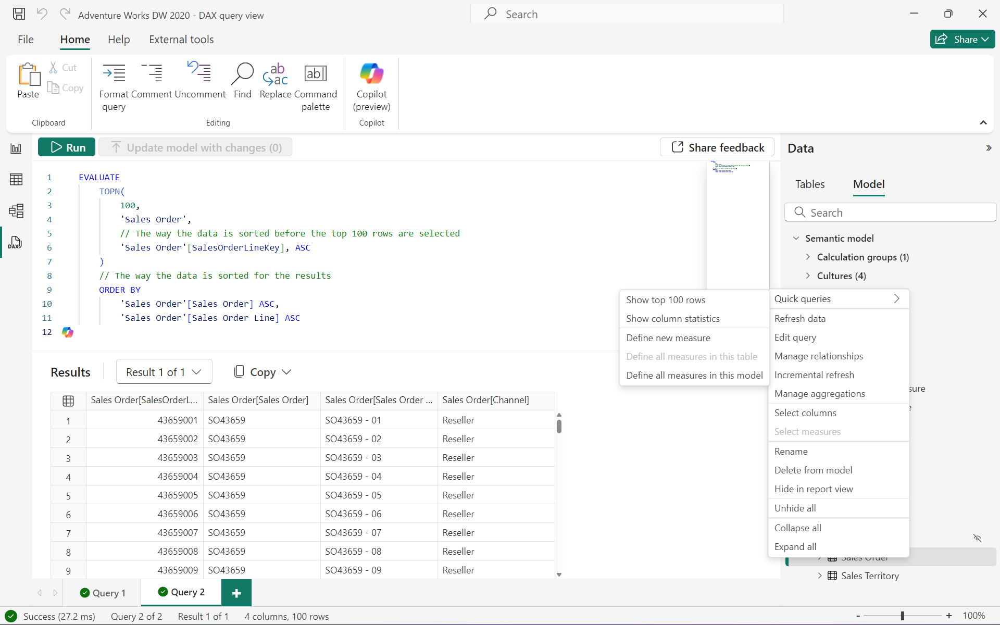
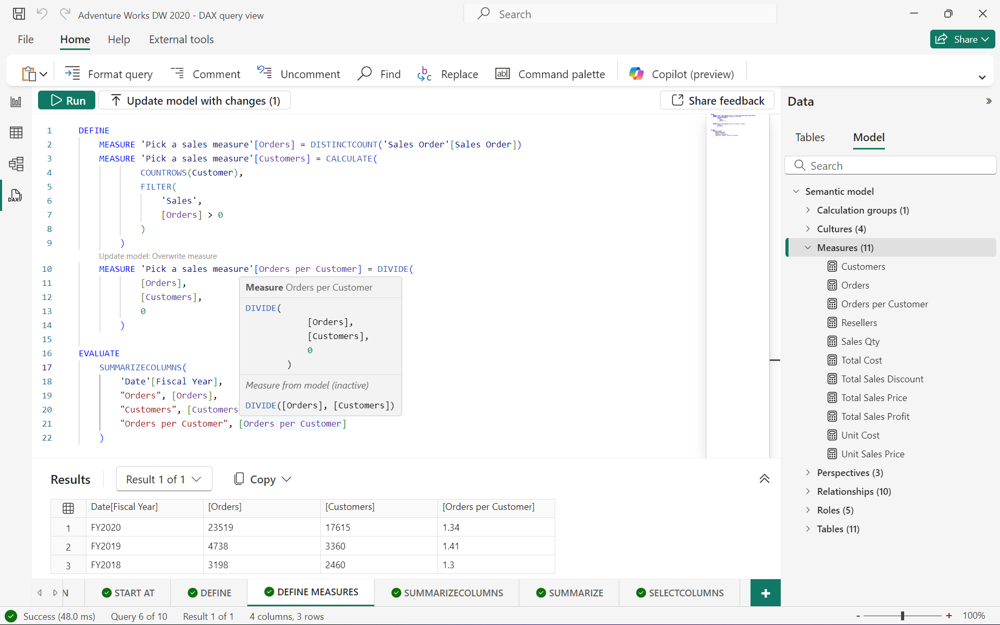

# DAX queries

Reporting clients like Power BI and Excel execute DAX queries whenever visuals display in a report, or a field added to a table, and these DAX queries adjust when a filter is applied. The [performance analyzer](/power-bi/create-reports/desktop-performance-analyzer) in Power BI Desktop can show you these DAX queries and even run them in the DAX query view. By using [DAX query view](/power-bi/transform-model/dax-query-view) in Power BI Desktop, [Write DAX queries](/power-bi/transform-model/dax-query-view#dax-query-view-in-web) in Power BI service, you can create and run your own DAX queries. With [Microsoft Fabric](/fabric/get-started/microsoft-fabric-overview), you can increase your productivity with Fabric [Copilot to write DAX queries](/dax/dax-copilot) in DAX query view of Desktop or web. Other tools such as [SQL Server Management Studio](/sql/ssms/download-sql-server-management-studio-ssms) (SSMS), [Power BI Report Builder](/power-bi/paginated-reports/report-builder-power-bi), and open-source tools like [DAX Studio](https://daxstudio.org), also allow you to create and run DAX queries. DAX queries return results as a table right within the tool, allowing you to quickly create and test the performance of your DAX formulas in measures or simply view the data in your semantic model. INFO and INFO.VIEW DAX functions can also get information about your semantic model, such as a listing of tables, columns, measures, and much more.

Before learning about queries, it is important you have a solid understanding of DAX basics. If you haven't already, be sure to check out [DAX overview](dax-overview.md).

## Keywords

DAX queries have a simple syntax comprised of just one required keyword, EVALUATE. EVALUATE is followed by a table expression, such as  a DAX function or table name, that when run outputs a result table. 
Table expressions that output a result table include:

1.	Common DAX functions that output a table, such as [SUMMARIZE](summarize-function-dax.md), [SUMMARIZECOLUMNS](summarizecolumns-function-dax.md), [SELECTCOLUMNS](selectcolumns-function-dax), [FILTER](filter-function-dax.md), [UNION](union-function-dax.md), [TOPN](topn-function-dax.md), [ADDCOLUMNS](addcolumns-function-dax.md), [DATATABLE](datatable-function-dax.md), and many others, work with EVALUATE to output a result table. 
2.	Tables in the model when referenced by name work with EVALUATE to output a result table showing the data in the table. For example, **EVALUATE ‘Table name’** can be ran as a DAX query.
3.	Measures in the model or any DAX formula, which return a scalar value, work with EVALUATE to show the value as a result table when enclosed in curly braces. For example, **EVALUATE {[Total Sales]}** or **EVALUATE {COUNTROWS(‘Sales’)}** can be ran as a DAX query. These are called [table constructors](table-constructor.md).

There are several optional keywords specific to DAX queries: ORDER BY, START AT, DEFINE, MEASURE, VAR, TABLE, and COLUMN. 


### EVALUATE (Required)

At the most basic level, a DAX query is an **EVALUATE** statement containing a table expression. At least one EVALUATE statement is required, however, a query can contain any number of EVALUATE statements.

#### EVALUATE Syntax
  
```dax
EVALUATE <table>  
```

#### EVALUATE Parameters

|Term  |Definition  |
|---------|---------|
|  table     |   A table expression.  |

#### EVALUATE Example

```dax
EVALUATE
	'Sales Order'
```

Returns all rows and columns from the Sales Order table, as a result table. This can be limited with the use of [TOPN](topn-function-dax.md) or [FILTER](filter-function-dax.md), and sorted with ORDER BY.


### ORDER BY (Optional)

The optional **ORDER BY** keyword defines one or more columns in the query or expressions used to sort query results. Any expression that can be evaluated for each row of the result is valid. Any column in the query itself is also valid.

Sort by column property in semantic models do not apply to DAX query results. If a column should be sorted by a different column in the model, such as in the case of Month Name, the sort by column should also be included in the DAX query to be used in the ORDER BY.

#### ORDER BY Syntax

```dax
EVALUATE <table>  
[ORDER BY {<expression> [{ASC | DESC}]}[, …]]  
```

#### ORDER BY Parameters

|Term  |Definition  |
|---------|---------|
|  expression     |   Any DAX expression that returns a single scalar value, or column included in the DAX query.  |
| ASC  | (default) Ascending sort order. |
| DESC  | Descending sort order. |

#### ORDER BY Example

```dax
EVALUATE
	SUMMARIZECOLUMNS(
		// Group by columns
		'Date'[Month Name],
		'Date'[Month of Year],
		'Product'[Category],

		// Optional filters
		FILTER(
			VALUES('Product'[Category]),
			[Category] = "Clothing"
		),

		// Measures or explicit DAX formulas to aggregate and analyze the data by row
		"Orders", [Orders],
		"Avg Profit per Order", DIVIDE(
			[Total Sales Profit],
			[Orders]
		)
	)

	// DAX queries do not use sort order defined in Power BI, 
	// sort by columns must be included in the DAX query to be used in order by
	ORDER BY 'Date'[Month of Year] ASC
```

Returns clothing orders and average profit per order by month, in ascending order by month, as a result table.


TOPN does not choose the specified number of rows to return based on the sort order specified in ORDER BY. Instead, TOPN has its own syntax to optionally specify a sort before the top 100 rows are return. ORDER BY only sorts the result table returned by TOPN. 

```dax
EVALUATE
	TOPN(
		100,
		'Sales Order',
		// The way the data is sorted before the top 100 rows are selected
		'Sales Order'[SalesOrderLineKey], ASC
	)
	// The way the data is sorted for the results
	ORDER BY
		'Sales Order'[Sales Order] ASC,
		'Sales Order'[Sales Order Line] ASC
```

Returns the top 100 sales orders sorted by SalesOrderLienKey ascending, then sorts the results first by sales order, then by sales order line.



### START AT (Optional)

The optional **START AT** keyword is used inside an **ORDER BY** clause. It defines the value at which the query results begin. 

#### START AT Syntax

```dax
EVALUATE <table>  
[ORDER BY {<expression> [{ASC | DESC}]}[, …]  
[START AT {<value>|<parameter>} [, …]]]
```

#### START AT Parameters

|Term  |Definition  |
|---------|---------|
|  value     |   A constant value. Cannot be an expression.  |
|  parameter     |   The name of a parameter in an XMLA statement prefixed with an `@` character.  |

#### START AT Remarks
  
START AT arguments have a one-to-one correspondence with the columns in the ORDER BY clause. There can be as many arguments in the START AT clause as there are in the ORDER BY clause, but not more. The first argument in the START AT defines the starting value in column 1 of the ORDER BY columns. The second argument in the START AT defines the starting value in column 2 of the ORDER BY columns within the rows that meet the first value for column 1.  

#### START AT Example

```dax
EVALUATE
	'Sales Order'
	ORDER BY 'Sales Order'[Sales Order] ASC
	// Start at this order, orders before this order will not be displayed
	START AT "SO43661"
```

Returns all columns from the Sales Order table, in ascending order by Sales Order, beginning at SO43661. Rows before this sales order are not included in the result table.


### DEFINE (Optional)

The optional **DEFINE** keyword introduces one or more calculated entity definitions that exist only for the duration of the query. Unlike EVALUATE, there can only be one DEFINE block with one or more definitions in a DAX query. DEFINE must precede the first EVALUATE statement and are valid for all EVALUATE statements in the query. Definitions can be variables, measures, tables<sup>[1](#not-rec)</sup>, and columns<sup>[1](#not-rec)</sup>.Definitions can reference other definitions that appear before or after the current definition. At least one definition is required if the DEFINE keyword is included in a query.

**DEFINE MEASURE** is a common scenario to build new measures or edit existing measures in a semantic model. When the measure already exists in the model, the DAX query will use the measure DAX formula defined in the query. This is helpful for testing measures with a DAX query before updating the model. 

**DEFINE MEASURE** is also helpful to build additional analysis with DAX formulas for a specific DAX query where you may not have permission to add a model measure or it is not necessary to have it in the model. 

#### DEFINE Syntax

```dax
[DEFINE 
    (
     (MEASURE <table name>[<measure name>] = <scalar expression>) | 
     (VAR <var name> = <table or scalar expression>) |
     (TABLE <table name> = <table expression>) | 
     (COLUMN <table name>[<column name>] = <scalar expression>) | 
    ) + 
]

(EVALUATE <table expression>) +
```

#### DEFINE Parameters

|Term|Definition|  
|--------|--------------|  
|Entity|MEASURE, VAR, TABLE<sup>[1](#not-rec)</sup>, or COLUMN<sup>[1](#not-rec)</sup>. |
|name|The name of a measure, var, table, or column definition. It cannot be an expression. The name does not have to be unique. The name exists only for the duration of the query.|  
|expression|Any DAX expression that returns a table or scalar value. The expression can use any of the defined entities. If there is a need to convert a scalar expression into a table expression, wrap the expression inside a table constructor with curly braces `{}`, or use the `ROW()` function to return a single row table.|  

<a name="not-rec">[1]</a> **Caution:** Query scoped TABLE and COLUMN definitions are meant for internal use only. While you can define TABLE and COLUMN expressions for a query without syntax error, they may produce runtime errors and are not recommended.

#### DEFINE Remarks

- A DAX query can have multiple EVALUATE statements, but can have only one DEFINE statement. Definitions in the DEFINE statement can apply to any EVALUATE statements in the query.

- At least one definition is required in a DEFINE statement.

- Measure definitions for a query override model measures of the same name but are only used within the query. They will not affect the model measure.

- VAR names have unique  restrictions. To learn more, see [VAR - Parameters](var-dax.md#parameters).

#### DEFINE Example

```dax
DEFINE
	VAR _firstyear = MIN('Date'[Fiscal Year])
	VAR _lastyear = MAX('Date'[Fiscal Year])
	TABLE 'Unbought products' = FILTER('Product', [Orders] + 0 = 0)
	COLUMN 'Unbought products'[Year Range] = _firstyear & " - " & _lastyear
	MEASURE 'Unbought products'[Unbought products] = COUNTROWS('Unbought products')
	
EVALUATE
	'Unbought products'
	
EVALUATE
	{[Unbought products]}
```

Returns the table defined in the DAX query to show unbought products with an additional defined column referencing defined variables. A measures is also defined and evulated counting the rows of unbought products.


```dax
DEFINE
	MEASURE 'Pick a sales measure'[Orders] = DISTINCTCOUNT('Sales Order'[Sales Order])
	MEASURE 'Pick a sales measure'[Customers] = CALCULATE(
			COUNTROWS(Customer),
			FILTER(
				'Sales',
				[Orders] > 0
			)
		)
	MEASURE 'Pick a sales measure'[Orders per Customer] = DIVIDE(
			[Orders],
			[Customers],
			0
		)

EVALUATE
	SUMMARIZECOLUMNS(
		'Date'[Fiscal Year],
		"Orders", [Orders],
		"Customers", [Customers],
		"Orders per Customer", [Orders per Customer]
	)
```
Returns a table evaluating three defined measures to show the results by fiscal year. All measures also exist in the model, and Orders per Customer is modified in the DAX query.



## Parameters in DAX queries  

A well-defined DAX query statement can be parameterized and then used over and over with just changes in the parameter values.  
  
The [Execute Method (XMLA)](/analysis-services/xmla/xml-elements-methods-execute) method has a [Parameters Element (XMLA)](/analysis-services/xmla/xml-elements-properties/parameters-element-xmla) collection element that allows parameters to be defined and assigned a value. Within the collection, each [Parameter Element (XMLA)](/analysis-services/xmla/xml-elements-properties/parameter-element-xmla) element defines the name of the parameter and a value to it.  
  
Reference XMLA parameters by prefixing the name of the parameter with an `@` character. Any place in the syntax where a value is allowed, the value can be replaced with a parameter call. All XMLA parameters are typed as text.  
  
> [!IMPORTANT]
> Parameters defined in the parameters section and not used in the **\<STATEMENT>** element generate an error response in XMLA.
> Parameters used and not defined in the **\<Parameters>** element generate an error response in XMLA.
  
## Related content

[DAX statements](statements-dax.md)  
[SUMMARIZECOLUMNS](summarizecolumns-function-dax.md)  
