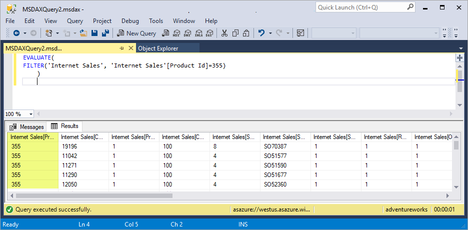
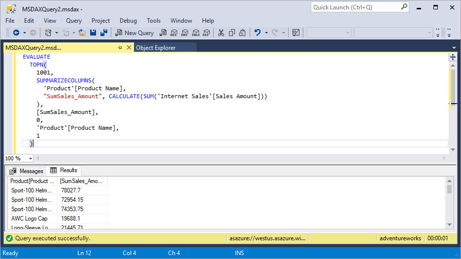

# DAX queries

With DAX queries, you can query and retrieve data defined by a table expression from the in-memory analytics engine (VertiPaq). Reporting clients construct DAX queries whenever a field is placed on a report surface, or a whenever a filter or calculation is applied. DAX queries can also be created and run in [SQL Server Management Studio](https://docs.microsoft.com/sql/ssms/download-sql-server-management-studio-ssms) (SSMS) and open-source tools like [DAX Studio](daxstudio.org). Creating and executing DAX queries in SSMS and DAX Studio can be useful when testing query formulas or needing to query model data without using a reporting client.

Examples shown use the [adventureworks sample model](https://docs.microsoft.com/azure/analysis-services/analysis-services-create-sample-model) database on an Azure Analysis Services server resource.


## Statements  

### EVALUATE

At the most basic level, a DAX query contains a required **EVALUATE** statement containing a `<table>` expression that queries the engine and returns the results of the query.  

#### Syntax  
  
```dax
EVALUATE <table>  
```

#### Arguments
|Term  |Definition  |
|---------|---------|
|  table     |   A table expression.  |


#### Example

```dax
EVALUATE(
    'Internet Sales'
    )
```

Returns all rows and columns from the Internet Sales table, as a table.


### ORDER BY 

The optional **ORDER BY** keyword defines the expression(s) used to sort query results. Any expression that can be evaluated for each row of the result is valid.  

#### Syntax
```dax
EVALUATE <table>  
[ORDER BY {<expression> [{ASC | DESC}]}[, …]  
```

#### Arguments
|Term  |Definition  |
|---------|---------|
|  expression     |   Any DAX expression that returns a single scalar value.  |

#### Example

```dax
EVALUATE(
    'Internet Sales'
    )
ORDER BY
	'Internet Sales'[Order Date]
```

Returns all rows and columns from the Internet Sales table, ordered by Order Date, as a table.


### START AT

The optional **START AT** keyword is used inside an **ORDER BY** clause that defines the values at which the query results will begin. The START AT clause is part of the ORDER BY clause and cannot be used outside it.

#### Syntax

```dax
EVALUATE <table>  
[ORDER BY {<expression> [{ASC | DESC}]}[, …]  
[START AT {<value>|<parameter>} [, …]]]  
```

#### Arguments

|Term  |Definition  |
|---------|---------|
|  value     |   A constant value. Cannot be an expression.  |
|  parameter     |   The name of a parameter in an XMLA statement prefixed with an `@` character.  |
  
START AT arguments have a one-to-one correspondence with the columns in the ORDER BY clause. There can be as many arguments in the START AT clause as there are in the ORDER BY clause, but not more. The first argument in the START AT defines the starting value in column 1 of the ORDER BY columns. The second argument in the START AT defines the starting value in column 2 of the ORDER BY columns within the rows that meet the first value for column 1.  

Multiple **EVALUATE**/**ORDER BY**/**START AT** clauses can be specified in a single query.

### DEFINE

The optional **DEFINE** keyword can define measures for the duration of the query. Definitions can reference other definitions that appear before or after the current definition. 

### Syntax  
  
```dax
[DEFINE {  MEASURE <tableName>[<name>] = <expression> } 
        {  VAR <name> = <expression>}]
EVALUATE <table>  
```

### Arguments
|Term  |Definition  |
|---------|---------|
|tableName     |   The name of an existing table using standard DAX syntax. It cannot be an expression.       |
|name     |   The name of a new measure. It cannot be an expression.      |
|  expression  |  Any DAX expression that returns a single scalar value. The expression can use any of the defined measures. The expression must return a table. If a scalar value is required, wrap the scalar inside a ROW() function to produce a table.  |
|VAR     |   An optional expression as a named variable. A VAR can be passed as an argument to other expressions.      |

#### Example

```dax
DEFINE
    VAR SalesCount =
        COUNT ()
EVALUATE(
    'Internet Sales'
    )
```

## Filtering results

Use the [FILTER](filter-function-dax.md) function to return a subset of rows containing a specified value.

#### Example

```dax
EVALUATE(
FILTER('Internet Sales', 'Internet Sales'[Product Id]=355)
	)
```

Returns all rows and columns from the Internet Sales table, filtered by a product ID of 355, as a table.



## Grouping results

Use the [SUMMARIZECOLUMNS](summarizecolumns-function-dax.md)  function to return a summary table over a set of groups. 

#### Example

```dax
EVALUATE
  TOPN(
    1001,
    SUMMARIZECOLUMNS(
      'Product'[Product Name],
      "SumSales_Amount", CALCULATE(SUM('Internet Sales'[Sales Amount]))
    ),
    [SumSales_Amount],
    0,
    'Product'[Product Name],
    1
  )
```

Returns all rows from the product table by product name, and calculates an aggregated sum of sales amount for each product.




## Parameters in DAX queries  

A well-defined DAX query statement can be parameterized and then used over and over with just changes in the parameter values.  
  
The [Execute Method (XMLA)](https://docs.microsoft.com/bi-reference/xmla/xml-elements-methods-execute) method has a [Parameters Element (XMLA)](https://docs.microsoft.com/bi-reference/xmla/xml-elements-properties/parameters-element-xmla) collection element that allows parameters to be defined and assigned a value. Within the collection, each [Parameter Element (XMLA)](https://docs.microsoft.com/bi-reference/xmla/xml-elements-properties/parameter-element-xmla) element defines the name of the parameter and a value to it.  
  
The DAX query syntax allows you to reference XMLA parameters by prefixing the name of the parameter with an `@` character. Hence, any place in the syntax where a value is allowed it can be replaced with a parameter call. Keep in-mind all XMLA parameters are typed as text.  
  
> [!IMPORTANT]  
> Parameters defined in the parameters section and not used in the **&lt;STATEMENT&gt;** element generate an error response in XMLA.  
  
> [!IMPORTANT]  
> Parameters used and not defined in the **&lt;Parameters&gt;** element generate an error response in XMLA.  
  
## See also

[DAX function reference](dax-function-reference.md)   
[DAX overview](dax-overview.md)

  