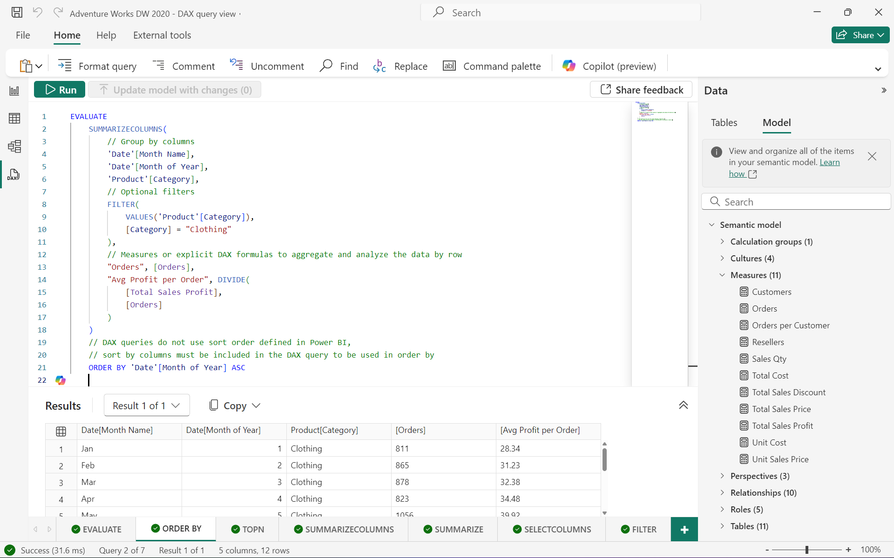

# DAX queries

With DAX queries, you can query and return data defined by a table expression. Reporting clients like Power BI and Excel construct DAX queries whenever a field is placed on a report surface, or when a filter is applied.

You can can also create and run your own DAX queries in [SQL Server Management Studio](/sql/ssms/download-sql-server-management-studio-ssms) (SSMS), [Power BI Report Builder](/power-bi/paginated-reports/report-builder-power-bi), and open-source tools like [DAX Studio](https://daxstudio.org). DAX queries return results as a table right within the tool, allowing you to quickly create and test the performance of your DAX formulas.

Before learning about queries, it's important you have a solid understanding of DAX basics. If you haven't already, be sure to checkout [DAX overview](dax-overview.md).

## Keywords

DAX queries have a simple syntax comprised of just one required keyword, EVALUATE, and several optional keywords; ORDER BY, START AT, DEFINE, MEASURE, VAR, TABLE, and COLUMN. Each keyword defines a statement used for the duration of the query.

### EVALUATE (Required)

At the most basic level, a DAX query is an **EVALUATE** statement containing a table expression. At least one EVALUATE statement is required, however, a query can contain any number of EVALUATE statements.

#### EVALUATE Syntax
  
```dax
EVALUATE <table>  
```

#### EVALUATE Arguments

|Term  |Definition  |
|---------|---------|
|  table     |   A table expression.  |

#### EVALUATE Example

```dax
EVALUATE
    'Internet Sales'
```

Returns all rows and columns from the Internet Sales table, as a table.


### ORDER BY (Optional)

The optional **ORDER BY** keyword defines one or more expressions used to sort query results. Any expression that can be evaluated for each row of the result is valid.  

#### ORDER BY Syntax

```dax
EVALUATE <table>  
[ORDER BY {<expression> [{ASC | DESC}]}[, …]  
```

#### ORDER BY Arguments

|Term  |Definition  |
|---------|---------|
|  expression     |   Any DAX expression that returns a single scalar value.  |
| ASC  | (default) Ascending sort order. |
| DESC  | Descending sort order. |

#### ORDER BY Example

```dax
EVALUATE
    'Internet Sales'
    
ORDER BY
    'Internet Sales'[Order Date]
```

Returns all rows and columns from the Internet Sales table, in ascending order by Order Date, as a table.



### START AT (Optional)

The optional **START AT** keyword is used inside an **ORDER BY** clause. It defines the value at which the query results begin.

#### START AT Syntax

```dax
EVALUATE <table>  
[ORDER BY {<expression> [{ASC | DESC}]}[, …]  
[START AT {<value>|<parameter>} [, …]]]  
```

#### START AT Arguments

|Term  |Definition  |
|---------|---------|
|  value     |   A constant value. Cannot be an expression.  |
|  parameter     |   The name of a parameter in an XMLA statement prefixed with an `@` character.  |

#### START AT Remarks
  
START AT arguments have a one-to-one correspondence with the columns in the ORDER BY clause. There can be as many arguments in the START AT clause as there are in the ORDER BY clause, but not more. The first argument in the START AT defines the starting value in column 1 of the ORDER BY columns. The second argument in the START AT defines the starting value in column 2 of the ORDER BY columns within the rows that meet the first value for column 1.  

#### START AT Example

```dax
EVALUATE
    'Internet Sales'
    
ORDER BY
    'Internet Sales'[Sales Order Number]
START AT "SO7000"
```

Returns all rows and columns from the Internet Sales table, in ascending order by Sales Order Number, beginning at SO7000.


### DEFINE (Optional)

The optional **DEFINE** keyword introduces one or more calculated entity definitions that exist only for the duration of the query. Definitions precede the EVALUATE statement and are valid for all EVALUATE statements in the query. Definitions can be variables, measures, tables<sup>[1](#not-rec)</sup>, and columns<sup>[1](#not-rec)</sup>. Definitions can reference other definitions that appear before or after the current definition. At least one definition is required if the DEFINE keyword is included in a query.

#### DEFINE Syntax

```dax
[DEFINE 
    (
     (MEASURE <table name>[<measure name>] = <scalar expression>) | 
     (VAR <var name> = <table or scalar expression>) |
     (TABLE <table name> = <table expression>) | 
     (COLUMN <table name>[column name] = <scalar expression>) | 
    ) + 
]

(EVALUATE <table expression>) +
```

#### DEFINE Arguments

|Term|Definition|  
|--------|--------------|  
|Entity|MEASURE, VAR, TABLE<sup>[1](#not-rec)</sup>, or COLUMN<sup>[1](#not-rec)</sup>. |
|name|The name of a measure, var, table, or column definition. It cannot be an expression. The name does not have to be unique. The name exists only for the duration of the query.|  
|expression|Any DAX expression that returns a table or scalar value. The expression can use any of the defined entities. If a scalar value is required, wrap the expression inside a table constructor with curly braces `{}`, or use the `ROW()` function to return a single row table.|  

<a name="not-rec">[1]</a> **Caution:** Query scoped TABLE and COLUMN definitions are meant for internal use only. While you can define TABLE and COLUMN expressions for a query, they may produce inconsistent results and are not recommended.

#### DEFINE Remarks

- A DAX query can have multiple EVALUATE statements, but can have only one DEFINE statement. Definitions in the DEFINE statement can apply to any EVALUATE statements in the query.

- At least one definition is required in a DEFINE statement.

- Measure definitions for a query override model measures of the same name but are only used within the query. They will not effect the model measure.

- The expression for a measure definition can be used with any other expression in the same query.

- VAR names have unique  restrictions. To learn more, see [VAR - Parameters](var-dax.md#parameters).

#### DEFINE Example

```dax
DEFINE
    MEASURE 'Internet Sales'[Internet Total Sales] =
        SUM ( 'Internet Sales'[Sales Amount] )

EVALUATE
SUMMARIZECOLUMNS (
    'Date'[Calendar Year],
    TREATAS (
        {
            2013,
            2014
        },
        'Date'[Calendar Year]
    ),
    "Total Sales", [Internet Total Sales],
    "Combined Years Total Sales",
        CALCULATE (
            [Internet Total Sales],
            ALLSELECTED ( 'Date'[Calendar Year] )
        )
)
ORDER BY [Calendar Year]
```

Returns the calculated total sales for years 2013 and 2014, and combined calculated total sales for years 2013 and 2014, as a table. The measure in the DEFINE statement, Internet Total Sales, is used in both Total Sales and Combined Years Total Sales expressions.


## Parameters in DAX queries  

A well-defined DAX query statement can be parameterized and then used over and over with just changes in the parameter values.  
  
The [Execute Method (XMLA)](/analysis-services/xmla/xml-elements-methods-execute) method has a [Parameters Element (XMLA)](/analysis-services/xmla/xml-elements-properties/parameters-element-xmla) collection element that allows parameters to be defined and assigned a value. Within the collection, each [Parameter Element (XMLA)](/analysis-services/xmla/xml-elements-properties/parameter-element-xmla) element defines the name of the parameter and a value to it.  
  
Reference XMLA parameters by prefixing the name of the parameter with an `@` character. Any place in the syntax where a value is allowed, the value can be replaced with a parameter call. All XMLA parameters are typed as text.  
  
> [!IMPORTANT]
> Parameters defined in the parameters section and not used in the **\<STATEMENT>** element generate an error response in XMLA.
> Parameters used and not defined in the **\<Parameters>** element generate an error response in XMLA.
  
## See also

[SUMMARIZECOLUMNS](summarizecolumns-function-dax.md)  
[TREATAS](treatas-function.md)  
[VAR](var-dax.md)  
[FILTER](filter-function-dax.md)  
