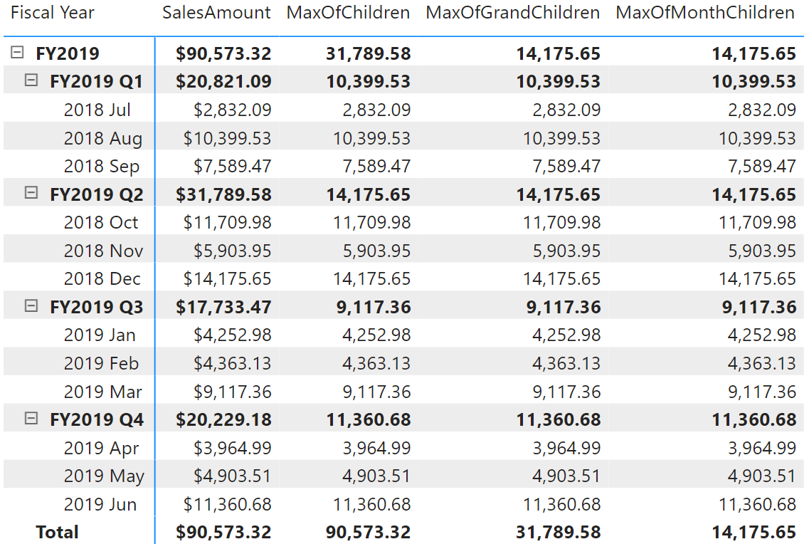

# EXPAND

[!INCLUDE[applies-to-visual-calculations](includes/applies-to-visual-calculations.md)]

Retrieves a context with added levels of detail compared to the current context. If an expression is provided, returns its value in the new context, allowing for navigation in hierarchies and calculation at a more detailed level.

## Syntax

The syntaxes that perform both navigation and calculation.
```dax
EXPAND ( <expression>, <axis>[, N] )
EXPAND ( <expression>, <column>[, <column>] ... )
```

The syntaxes that perform navigation only.
```dax
EXPAND ( <axis>[, N] )
EXPAND ( <column>[, <column>] ... )
```

### Parameters

|Term|Definition|
|--------|--------------|
|`expression`|The expression to be evaluated in the new context.|
|`axis`|An axis reference.|
|`column`|A column in the data grid.|
|`N`|(Optional) The number of levels to expand. If omitted, the default value is 1.|

## Return value

For versions that perform both navigation and calculation, the function returns the value of the expression in the new context after navigating to a new level.
For versions that perform navigation only, the function modifies the evaluation context by navigating to a new level.

## Remarks

* This function can be used only in visual calculations.
* The navigation-only versions of the function can be used inside the CALCULATE function.
* The levels of the hierarchy are determined by all columns in each axis referenced by the axis reference.
* When columns are specified, the axes are determined by including each column's axis the first time it is encountered.
* When N is specified, the function navigates down the hierarchy N levels from the current level or the bottom level, whichever comes first.
* When multiple columns are specified, the function navigates down the hierarchy until it reaches the first level at which all the specified columns are present.
* Navigation begins at the current cell in the data matrix, descending down the hierarchy. If a specified column is at a level higher than the current cell, it will be disregarded.
* Often, there are multiple descendent cells at a lower level; therefore, some form of aggregation is required for the expression argument.

## Example

Given a table that summarizes the total sales for a hierarchy with levels for total, year, quarter and month, the following DAX calculations calculate the maximum value of [SalesAmount] at the child level, the grandchildren level, and the month level, respectively.

```dax
MaxOfChildren = EXPAND(MAX([SalesAmount]), ROWS)
MaxOfGrandChildren = EXPAND(MAX([SalesAmount]), ROWS, 2)
MaxOfMonthChildren = EXPAND(MAX([SalesAmount]), [Month])
```

The screenshot below shows the matrix with the three visual calculations.



## See also

[EXPANDALL](expandall-function-dax.md)
[COLLAPSE](collapse-function-dax.md)
[COLLAPSEALL](collapseall-function-dax.md)

