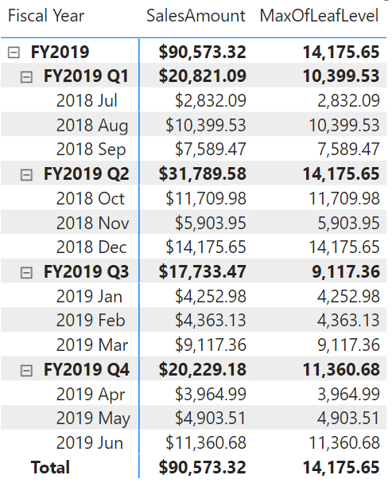

# EXPANDALL

Retrieves a context at the most detailed level. If an expression is provided, returns its value in the new context, allowing for navigation in hierarchies and calculation at the most detailed level.

## Syntax

The syntax that performs both navigation and calculation.
```dax
EXPANDALL ( <expression>, <axis> )
```

The syntax that performs navigation only.
```dax
EXPANDALL ( <axis> )
```

### Parameters

|Term|Definition|
|--------|--------------|
|expression|The expression to be evaluated in the new context.|
|axis|An axis reference.|

## Return value

For the version that performs both navigation and calculation, the function returns the value of the expression in the new context after navigating to the lowest level of the hierarchy.
For the version that performs navigation only, the function modifies the evaluation context by navigating to the lowest level of the hierarchy.

## Remarks

* This function can be used only in visual calculations.
* The navigation-only version of the function can be used inside the CALCULATE function.
* The levels of the hierarchy are determined by all columns in each axis referenced by the axis reference.
* Often, there are multiple descendent cells at a lower level; therefore, some form of aggregation is required for the expression argument.

## Example

Given a table that summarizes the total sales for a hierarchy with levels for total, year, quarter and month, the following DAX calculation calculates the maximum value of [SalesAmount] at the lowest level, [Month].

```dax
MaxOfLeafLevel = EXPANDALL(MAX([SalesAmount]), ROWS)
```

The screenshot below shows the matrix with the visual calculation.



## See also

[EXPAND](expand-function-dax.md)
[COLLAPSE](collapse-function-dax.md)
[COLLAPSEALL](collapseall-function-dax.md)


