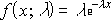
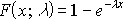

# EXPON.DIST Function (DAX)
Returns the exponential distribution. Use EXPON.DIST to model the time between events, such as how long an automated bank teller takes to deliver cash. For example, you can use EXPON.DIST to determine the probability that the process takes at most 1 minute.  
  
## Syntax  
  
```  
EXPON.DIST(x,lambda,cumulative)  
```  
  
#### Parameters  
  
|Term|Definition|  
|--------|--------------|  
|x|Required. The value of the function.|  
|lambda|Required. The parameter value.|  
|cumulative|Required. A logical value that indicates which form of the exponential function to provide. If cumulative is TRUE, EXPON.DIST returns the cumulative distribution function; if FALSE, it returns the probability density function.|  
  
## Return Value  
Returns the exponential distribution.  
  
## Remarks  
If x or lambda is nonnumeric, EXPON.DIST returns the #VALUE! error value. 

If x or lambda is not an integer, it is rounded. 
  
If x &lt; 0, EXPON.DIST returns the #NUM! error value.  
  
If lambda ≤ 0, EXPON.DIST returns the #NUM! error value.  
  
The equation for the probability density function is:  
  
  
  
The equation for the cumulative distribution function is:  
  
  
  
