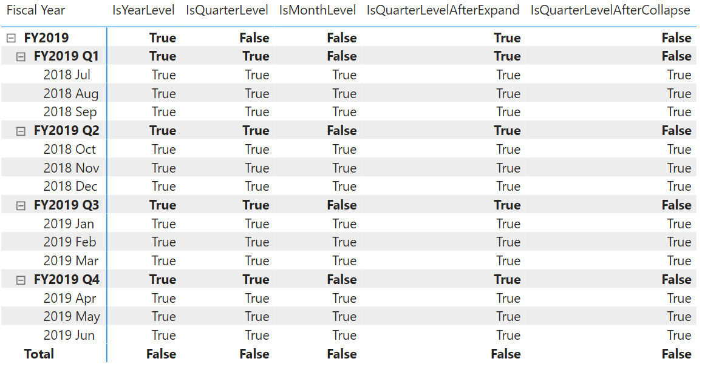

# ISATLEVEL

[!INCLUDE[applies-to-visual-calculations](includes/applies-to-visual-calculations.md)]

Reports whether the column is present at the current level.

## Syntax

```dax
ISATLEVEL ( <column> )
```

### Parameters

|Term|Definition|
|--------|--------------|
|`column`|A grouping column in the data grid.|

## Return value

`TRUE` or `FALSE` that indicates whether the grouping column is at the current level in the context.

## Remarks

* This function can be used only in visual calculations.
* Unlike other functions with similar functionality, such as ISINSCOPE, ISFILTERED, HASONEVALUE, and so on, ISATLEVEL is a function specialized for visual calculations, therefore it is guaranteed to be compatible with functions that navigate the levels of a hierarchy in the data matrix, such as EXPAND and COLLAPSE.
* A hierarchy level can contain more than one column. For example, in a [Year], [Quarter], [Month] hierarchy, the level that contains the [Quarter] column also includes the [Year] column at the same level.

## Example

Consider a table that includes a hierarchy with levels for total, year, quarter, and month. The following DAX calculations can be used to determine whether a specific column is at the current level in the original context or at the new level after a navigation operation.

```dax
IsYearLevel = ISATLEVEL([Fiscal Year])
IsQuarterLevel = ISATLEVEL([Fiscal Quarter])
IsMonthLevel = ISATLEVEL([Month])
IsQuarterLevelAfterExpand = EXPAND(ISATLEVEL([Fiscal Quarter]), ROWS)
IsQuarterLevelAfterCollapse = COLLAPSE(ISATLEVEL([Fiscal Quarter]), ROWS)
```

The screenshot below shows the matrix with the five visual calculations.



## See also

[EXPAND](expand-function-dax.md)  
[EXPANDALL](expandall-function-dax.md)  
[COLLAPSE](collapse-function-dax.md)  
[COLLAPSEALL](collapseall-function-dax.md)  
[ISINSCOPE](isinscope-function-dax.md)  
[ISFILTERED](isfiltered-function-dax.md)  
[HASONEVALUE](hasonevalue-function-dax.md)  


