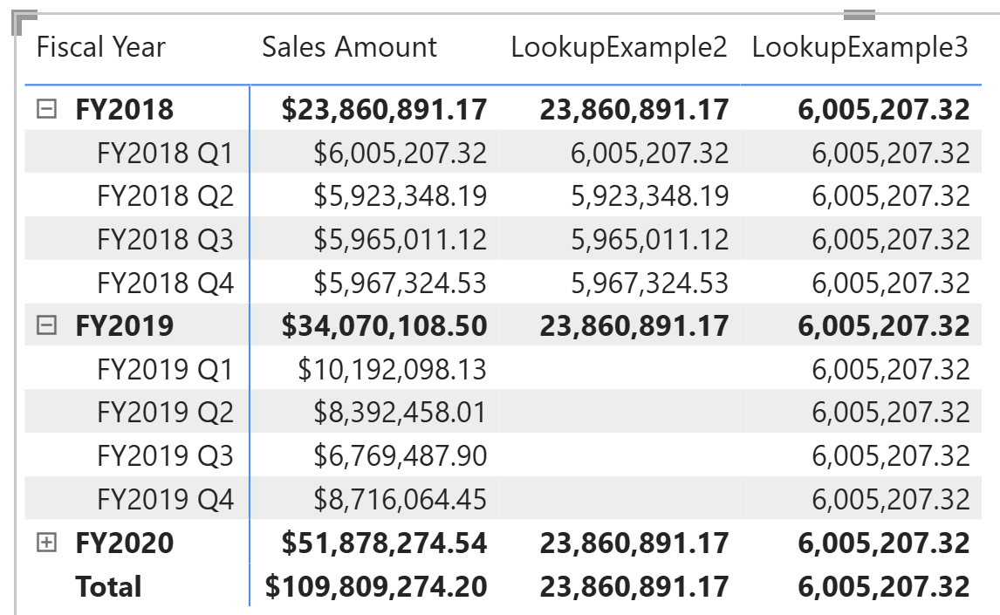

# LOOKUP

[!INCLUDE[applies-to-visual-calculations](includes/applies-to-visual-calculations.md)]

Returns value from cell in visual matrix by absolute navigation. You can specify value as a filter for any axis on the visual matrix. Anything not specified is inferred from the context. If Lookup can’t result in single value, an error is returned.

## Syntax

```dax
LOOKUP(<expression>, <colref>, <expression>[, <colref>, <expression>]...)
```

### Parameters

|Term|Definition|
|--------|--------------|
|expression| The expression that we wants to get. |
|colref|(Optional) The column to be filtered. For example, when we want [Category] = "Bikes", we put [Category] here.|
|expression|(Optional) The value to filter. In above example, put "Bikes" here.|

## Return value

The value of **expression** after filters are applied.

If there isn't a match, an error is returned.

If multiple rows match the filters, an error is returned.

## Example 1

In this example, LOOKUP retrieves the sum of sale for filters: [Category] = "Bikes".
The first argument could be a column or a scalar expression.

```dax
Lookup Example 1 = LOOKUP(SUM([Sales Amount]),  [Category], "Bikes")
Lookup Example 2 = LOOKUP([Sales Amount], [Category], "Bikes")
```

The screenshot below shows the matrix with two visual calculations.


## Example 2
In this example, LOOKUP example 2retrieves the sum of sale for filters: [Fiscal Year] = "FY2018". Notice that quarter filter from row will be used if we don't specify it directly. Example 3 specify 2018 Q1 so it will lock down to specific row.

```dax
LookupExample2 = LOOKUP([Sales Amount], [Fiscal Year], "FY2018")
LookupExample3 = LOOKUP([Sales Amount], [Fiscal Year], "FY2018", [Fiscal Quarter], "FY2018 Q1")
```




## Related content

[LOOKUPWITHTOTALS](lookupwithtotals-function-dax.md)
