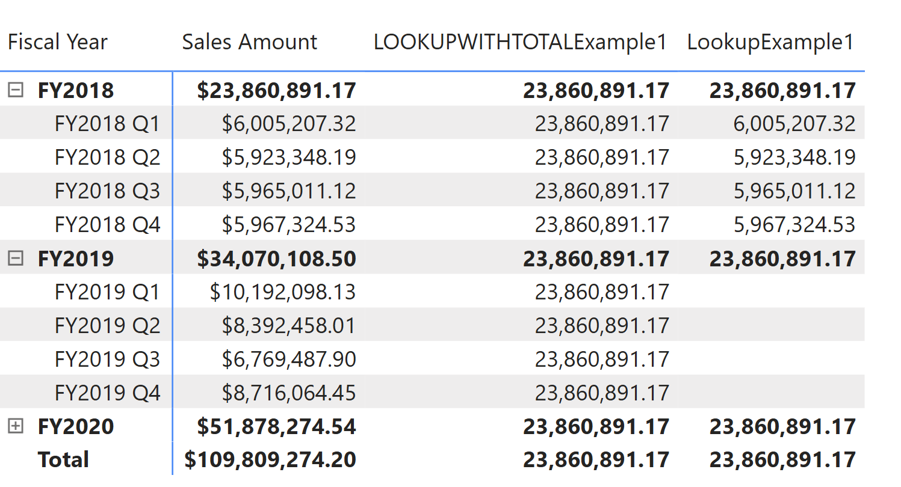
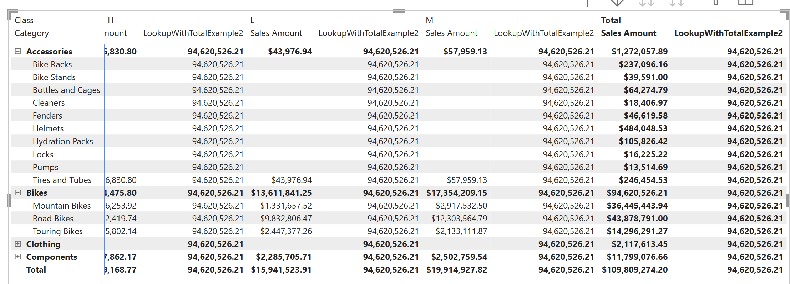

# LOOKUPWITHTOTALS

[!INCLUDE[applies-to-visual-calculations](includes/applies-to-visual-calculations.md)]

Returns value from cell in visual matrix by absolute navigation. You can specify value as a filter for any axis on the visual matrix. Other dimension that is not specified is treated as total grain. If Lookupwithtotals can’t result in single value, an error is returned.

## Syntax

```dax
LOOKUPWITHTOTALS(<expression>, <colref>, <expression>[, <colref>, <expression>]...)
```

### Parameters

|Term|Definition|
|--------|--------------|
|expression| The expression that we wants to get. |
|colref|(Optional) The column to be filtered. For example, when we want [Category] = "Bikes", we put [Category] here.|
|expression|(Optional) The value to filter. In above example, put "Bikes" here.|

## Return value

The value of **expression** after filters are applied.

If there isn't a match, an error is returned.

If multiple rows match the filters, an error is returned.

## Example 1

In this example, LOOKUPWITHTOTALS retrieves the sum of sale for filters: [Fiscal Year] = "FY2018".
The first argument could be a column or a scalar expression.
Notice that lookup will get filter from each quarter so the result change by row. Lookupwithtotals will get value from FY2018 and ignore quarter.

```dax
LOOKUPWITHTOTALExample1 = LOOKUPWITHTOTALS([Sales Amount], [Fiscal Year], "FY2018")

LookupExample1 = LOOKUP([Sales Amount], [Fiscal Year], "FY2018")
```

The screenshot below shows the matrix with two visual calculations.



## Example 2
In this example, LOOKUPWITHTOTALS retrieves the sum of sale for filters: [Category] = "Bikes". Notices that it get total grain for other filters. In other words, it is not filtered. It's useful when we want to do comparison since lookupwithtoal result is locked to a certain value.

```dax
LookupWithTotalExample2 = lookupWithTotals([Sales Amount], [Category], "Bikes")
```



## Related content

[Lookup](lookup-function-dax.md)
