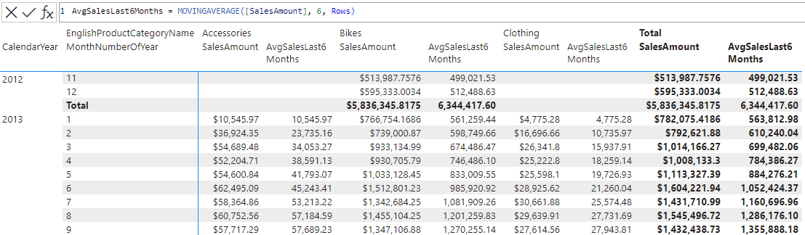

# MOVINGAVERAGE

[!INCLUDE[applies-to-visual-calculations](includes/applies-to-visual-calculations.md)]

Returns a moving average calculated along the given axis of the visual matrix. That is, the average of the given column calculated over the last `windowSize` rows.

## Syntax

```dax
MOVINGAVERAGE ( <column>, <windowSize>[, <includeCurrent>][, <axis>][, <orderBy>][, <blanks>][, <reset>] )
```

### Parameters

|Term|Definition|
|--------|--------------|
|`column`|The column that provides the value for each element.|
|`windowSize`|The number of rows to include in the calculation. Must be a constant value.|
|`includeCurrent`|(Optional) A logical value specifying whether or not to include the current row in the range. Default value is True.|
|`axis`|(Optional) An axis reference, the direction along which the moving average will be calculated. If omitted, the first axis of the Visual Shape definition is used.|
|`orderBy`|(Optional) An ORDERBY() clause with expressions that determine the sort of each partition along the `axis`. If `orderBy` is not provided, the data is sorted by the grouping columns on the default `axis` in ascending order by default.|
|`blanks`|(Optional) An enumeration that defines how to handle blank values when sorting the `axis`. </br>The supported values are:<ul><li>`DEFAULT`(the default value), where the behavior for numerical values is blank values are ordered between zero and negative values. The behavior for strings is blank values are ordered before all strings, including empty strings.</li><li>`FIRST`, blanks are always ordered on the beginning, regardless of ascending or descending sorting order.</li><li>`LAST`, blanks are always ordered on the end, regardless of ascending or descending sorting order. </li></ul>|
|`reset`|(Optional) Indicates if the calculation resets, and at which level of the visual shape's column hierarchy. Accepted values are: a field reference to a column in the current visual shape, `NONE` (default), `LOWESTPARENT`, `HIGHESTPARENT`, or an integer. The behavior depends on the integer sign: </br> - If zero or omitted, the calculation does not reset. Equivalent to `NONE`. </br> - If positive, the integer identifies the column starting from the highest, independent of grain. `HIGHESTPARENT` is equivalent to 1. </br> - If negative, the integer identifies the column starting from the lowest, relative to the current grain. `LOWESTPARENT` is equivalent to -1.|

## Return value

A scalar value, the moving average at the current element of the axis.

## Remarks

This function can be used in visual calculations only.

The `includeCurrent`, `axis`, `orderBy`, `blanks` and `reset` parameters can be omitted.

If the value of `reset` is absolute (i.e., a positive integer, `HIGHESTPARENT` or a field reference) and the calculation is evaluated at or above the target level in the hierarchy, the calculation resets for each individual element. That is, the function is evaluated within a partition containing only that specific element.

## Example 1

Given a table that summarizes the total sales for each product category and calendar month, the following DAX query adds a column with the average of total sales for that category in the last 6 months:

```dax
AvgSalesLast6Months = MOVINGAVERAGE([SalesAmount], 6, Rows)
```

The screenshot below shows the visual matrix and the visual calculation expression:



## Example 2

Given the same table, the following DAX query adds a column with the average of total sales for that category in the previous 12 months (not including the current month):

```dax
AvgSalesPrev12Months = MOVINGAVERAGE([SalesAmount], 12, FALSE, Rows, KEEP)
```

## See also

[INDEX](index-function-dax.md)
[ORDERBY](orderby-function-dax.md)
[PARTITIONBY](partitionby-function-dax.md)
[RUNNINGSUM](runningsum-function-dax.md)
[WINDOW](window-function-dax.md)
