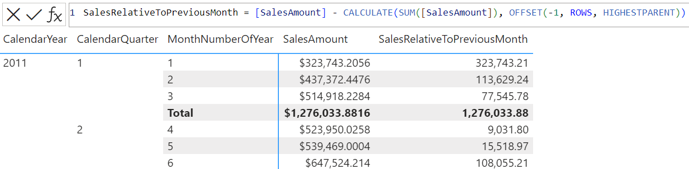

# OFFSET

[!INCLUDE[applies-to-measures-columns-tables-visual-calculations](includes/applies-to-measures-columns-tables-visual-calculations.md)]

Returns a single row that is positioned either before or after the *current row* within the same table, by a given offset. If the current row cannot be deduced to a single row, multiple rows may be returned.

## Syntax

```dax
OFFSET ( <delta>[, <relation> or <axis>][, <orderBy>][, <blanks>][, <partitionBy>][, <matchBy>][, <reset>] )
```

### Parameters

|Term|Definition|
|--------|--------------|
|`delta`|The number of rows before (negative value) or after (positive value) the current row from which to obtain the data.  It can be any DAX expression that returns a scalar value. |
|`relation`|(Optional) A table expression from which the output row is returned. </br>If specified, all columns in `partitionBy` must come from it or a related table. </br>If omitted: </br>- `orderBy` must be explicitly specified.</br>- All `orderBy` and `partitionBy` expressions must be fully qualified column names and come from a single table. </br>- Defaults to ALLSELECTED() of all columns in `orderBy` and `partitionBy`.|
|`axis`|(Optional) An axis in the visual shape. Available in visual calculations only, and replaces `relation`.
|`orderBy`|(Optional) An ORDERBY() clause containing the expressions that define how each partition is sorted. </br>If omitted: </br>- `relation` must be explicitly specified. </br>- Defaults to ordering by every column in `relation` that is not already specified in `partitionBy`.|
|`blanks`|(Optional) An enumeration that defines how to handle blank values when sorting. </br>This parameter is reserved for future use. </br>Currently, the only supported value is `DEFAULT`, where the behavior for numerical values is blank values are ordered between zero and negative values. The behavior for strings is blank values are ordered before all strings, including empty strings.|
|`partitionBy`|(Optional) A PARTITIONBY() clause containing the columns that define how `relation` is partitioned. </br> If omitted, `relation` is treated as a single partition. |
|`matchBy`|(Optional) A MATCHBY() clause containing the columns that define how to match data and identify the current row. |
|`reset`|(Optional) Available in visual calculations only. Indicates if the calculation resets, and at which level of the visual shape's column hierarchy. Accepted values are: `NONE`, `LOWESTPARENT`, `HIGHESTPARENT`, or an integer. The behavior depends on the integer sign: </br> - If zero or omitted, the calculation does not reset. Equivalent to `NONE`. </br> - If positive, the integer identifies the column starting from the highest, independent of grain. `HIGHESTPARENT` is equivalent to 1. </br> - If negative, the integer identifies the column starting from the lowest, relative to the current grain. `LOWESTPARENT` is equivalent to -1. |

## Return value

One or more rows from `relation`.

## Remarks

Except for columns added by DAX table functions, each column in `relation`, when `matchBy` is not present, or each column in `matchBy` and `partitionBy`, when `matchBy` is present, must have a corresponding outer value to help define the current row on which to operate, with the following behavior:

- If there is exactly one corresponding outer column, its value is used.
- If there is no corresponding outer column, then:
  - OFFSET will first determine all columns that have no corresponding outer column.
  - For every combination of existing values for these columns in OFFSET’s parent context, OFFSET is evaluated and a row is returned.
  - OFFSET’s final output is a union of these rows.
- If there is more than one corresponding outer column, an error is returned.

If all of `relation`'s columns were added by DAX table functions, an error is returned.

If `matchBy` is present, OFFSET will try to use `matchBy` and `partitionBy` columns to identify the row. 
If `matchBy` is not present and the columns specified within `orderBy` and `partitionBy` can't uniquely identify every row in `relation`, then:

- OFFSET will try to find the least number of additional columns required to uniquely identify every row.
- If such columns can be found, OFFSET will automatically append these new columns to `orderBy`, and each partition is sorted using this new set of OrderBy columns.
- If such columns cannot be found, an error is returned.

An empty table is returned if:

- The corresponding outer value of an OrderBy or PartitionBy column does not exist within `relation`.
- The `delta` value causes a shift to a row that does not exist within the partition.

If OFFSET is used within a calculated column defined on the same table as `relation`, and `orderBy` is omitted, an error is returned.

`reset` can be used in visual calculations only, and cannot be used in combination with `orderBy` or `partitionBy`. If `reset` is present, `axis` can be specified but `relation` cannot.

## Example 1 - calculated column

The following DAX query:

```dax
DEFINE
VAR vRelation = SUMMARIZECOLUMNS ( 
                    DimProductCategory[EnglishProductCategoryName], 
                    DimDate[CalendarYear], 
                    "CurrentYearSales", SUM(FactInternetSales[SalesAmount]) 
                  )
EVALUATE
ADDCOLUMNS (
    vRelation, 
    "PreviousYearSales", 
    SELECTCOLUMNS(
        OFFSET ( 
                -1, 
                vRelation, 
                ORDERBY([CalendarYear]), 
                PARTITIONBY([EnglishProductCategoryName])
        ),
        [CurrentYearSales]
    )
)

```

Returns a table that summarizes the total sales for each product category and calendar year, as well as the total sales for that category in the previous year.

## Example 2 - measure

The following DAX query:

```dax
DEFINE
MEASURE DimProduct[CurrentYearSales] = SUM(FactInternetSales[SalesAmount])
MEASURE DimProduct[PreviousYearSales] = CALCULATE(SUM(FactInternetSales[SalesAmount]), OFFSET(-1, , ORDERBY(DimDate[CalendarYear])))
EVALUATE
SUMMARIZECOLUMNS (
    DimDate[CalendarYear],
    "CurrentYearSales", DimProduct[CurrentYearSales],
    "PreviousYearSales", DimProduct[PreviousYearSales]
)
```

Uses OFFSET() in a measure to return a table that summarizes the total sales for each calendar year and the total sales for the previous year.

## Example 3 - calculated column

The following DAX query:

```dax
EVALUATE
ADDCOLUMNS (
    FactInternetSales,
    "Previous Sales Amount",
        SELECTCOLUMNS (
            OFFSET (
                -1,
                FactInternetSales,
                ORDERBY ( FactInternetSales[SalesAmount], DESC ),
                PARTITIONBY ( FactInternetSales[ProductKey] ),
                MATCHBY( FactInternetSales[SalesOrderNumber], FactInternetSales[SalesOrderLineNumber] )
            ),
            FactInternetSales[SalesAmount]
        )
)
```

Returns FactInternetSales table with adding a column, which indicates, for each sale, its previous sale's amount, of the same product, in descending order of sales amount, with current sale being identified by its SalesOrderNumber and SalesOrderLineNumber. Without MATCHBY, the query would return an error since there are no key columns in FactInternetSales table.

## Example 4 - visual calculation

The following visual calculation DAX query:

```dax
SalesRelativeToPreviousMonth = [SalesAmount] - CALCULATE(SUM([SalesAmount]), OFFSET(-1, ROWS, HIGHESTPARENT))
```

Returns the difference in total sales between each month and the previous one within the same year.

The screenshot below shows the visual matrix and the visual calculation expression:



## Related content

[INDEX](index-function-dax.md)
[ORDERBY](orderby-function-dax.md)
[PARTITIONBY](partitionby-function-dax.md)
[MATCHBY](matchby-function-dax.md)
[WINDOW](window-function-dax.md)
[RANK](rank-function-dax.md)
[ROWNUMBER](rownumber-function-dax.md)
