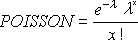

# POISSON.DIST function (DAX)
Returns the Poisson distribution. A common application of the Poisson distribution is predicting the number of events over a specific time, such as the number of cars arriving at a toll plaza in 1 minute.  
  
## Syntax  
  
```dax
POISSON.DIST(x,mean,cumulative)  
```
  
#### Parameters  
  
|Term|Definition|  
|--------|--------------|  
|x|Required. The number of events.|  
|mean|Required. The expected numeric value.|  
|cumulative|Required. A logical value that determines the form of the probability distribution returned. If cumulative is TRUE, POISSON.DIST returns the cumulative Poisson probability that the number of random events occurring will be between zero and x inclusive; if FALSE, it returns the Poisson probability mass function that the number of events occurring will be exactly x.|  
  
## Return value  
Returns the Poisson distribution.  
  
## Remarks  
If x is not an integer, it is rounded.  
  
If x or mean is nonnumeric, POISSON.DIST returns the #VALUE! error value.  
  
If x &lt; 0, POISSON.DIST returns the #NUM! error value.  
  
If mean &lt; 0, POISSON.DIST returns the #NUM! error value.  
  
POISSON.DIST is calculated as follows.  
  
For cumulative = FALSE:  
  
  
  
For cumulative = TRUE:  
  
  
  
