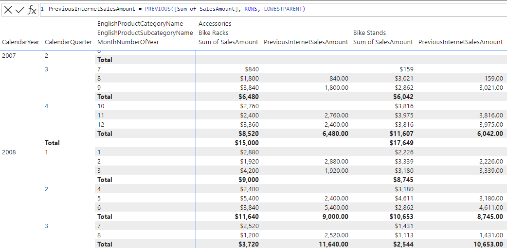

# PREVIOUS

[!INCLUDE[applies-to-visual-calculations](includes/applies-to-visual-calculations.md)]

Used in visual calculations only. Retrieves a value in the previous element of an axis in the visual matrix.

## Syntax

```dax
PREVIOUS ( <column>[, <steps>][, <axis>][, <blanks>][, reset] )
```

### Parameters

|Term|Definition|
|--------|--------------|
|`column`|The column to be retrieved.|
|`steps`| (Optional) Indicates the number of rows to go backward to fetch the value. If omitted, `1` is used (the exactly previous row).|
|`axis`|(Optional) An axis reference. If omitted, the first axis of the Visual Shape definition is used.|
|`blanks`|(Optional) An enumeration that defines how to handle blank values when sorting. </br>The supported values are:<ul><li>`DEFAULT` (the default value), where the behavior for numerical values is blank values are ordered between zero and negative values. The behavior for strings is blank values are ordered before all strings, including empty strings.</li><li>`FIRST`, blanks are always ordered on the beginning, regardless of ascending or descending sorting order.</li><li>`LAST`, blanks are always ordered on the end, regardless of ascending or descending sorting order. </li></ul>|
|`reset`|(Optional) Specifies how the calculation restarts. Valid values are: `None`, `LowestParent`, `HighestParent`, or an integer. None is the default value.|

## Return value

The value of `column` from the previous element of the axis.

## Remarks

This function can only be used in a visual calculation.

## Example

The following visual calculation returns the sales amount of the previous row on ROWS axis, that resets on the lowest parent. 

```dax
PreviousInternetSalesAmount = PREVIOUS ( [Sum of SalesAmount], ROWS, LowestParent )
```

The screenshot below shows the visual matrix and the visual calculation expression:



## Related content

[FIRST](first-function-dax.md)
[LAST](last-function-dax.md)
[NEXT](next-function-dax.md)
