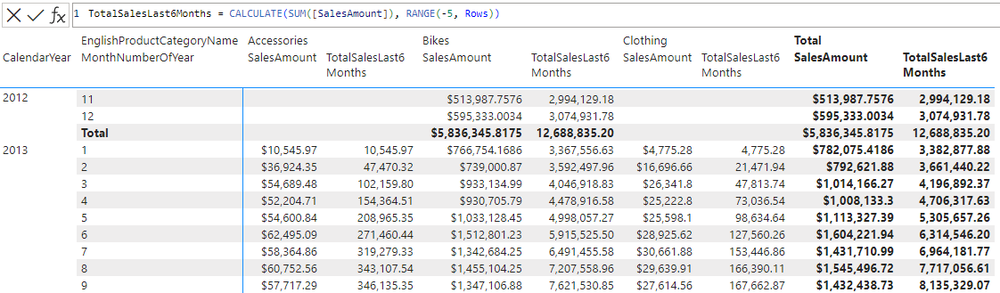

# RANGE

[!INCLUDE[applies-to-visual-calculations](includes/applies-to-visual-calculations.md)]

Returns an interval of rows within the given axis, relative to the current row. This interval will be comprised of either the last \<step> rows before the current one, or the first \<step> rows after the current one.

## Syntax

```dax
RANGE ( <step>[, <includeCurrent>][, <axis>][, <blanks>][, <reset>] )
```

### Parameters

|Term|Definition|
|--------|--------------|
|step|The number of rows before (negative value) or after (positive value) the current row to include in the range. Must be a constant value.</br>- If negative, the window will contain the last -step rows before the current row.</br>- Otherwise, the window will contain the first step rows after the current row.|
|includeCurrent|(Optional) A logical value specifying whether or not to include the current row in the range. Default value is True.|
|axis|(Optional) An axis reference, the direction along which the interval will be created.|
|blanks|(Optional) An enumeration that defines how to handle blank values when sorting. </br>The supported values are:<ul><li>DEFAULT (the default value), where the behavior for numerical values is blank values are ordered between zero and negative values. The behavior for strings is blank values are ordered before all strings, including empty strings.</li><li>FIRST, blanks are always ordered on the beginning, regardless of ascending or descending sorting order.</li><li>LAST, blanks are always ordered on the end, regardless of ascending or descending sorting order. </li></ul>|
|reset|(Optional) Indicates if the calculation resets, and at which level of the visual shape's column hierarchy. Accepted values are: NONE, LOWESTPARENT, HIGHESTPARENT, or an integer. The behavior depends on the integer sign: </br> - If zero or omitted, the calculation does not reset. Equivalent to NONE. </br> - If positive, the integer identifies the column starting from the highest, independent of grain. HIGHESTPARENT is equivalent to 1. </br> - If negative, the integer identifies the column starting from the lowest, relative to the current grain. LOWESTPARENT is equivalent to -1. |

## Return value

An interval of data rows.

## Remarks

This function can be used in visual calculations only.

The \<includeCurrent>, \<axis>, \<blanks> and \<reset> parameters can be omitted.

## Example 1

Given a table that summarizes the total sales for each product category and month, the following DAX query adds a column with the total sales in the last 6 months:

```dax
TotalSalesLast6Months = CALCULATE(SUM([SalesAmount]), RANGE(-5, Rows))
```

The screenshot below shows the visual matrix and the visual calculation expression:



## Example 2

Given the same table, the following DAX query adds a column with the total sales in the following 12 months, not including the current month:

```dax
TotalSalesFollowingYear = CALCULATE(SUM([SalesAmount]), RANGE(12, FALSE, Rows, KEEP))
```

## See also

[INDEX](index-function-dax.md)  
[ORDERBY](orderby-function-dax.md)  
[PARTITIONBY](partitionby-function-dax.md)  
[WINDOW](window-function-dax.md)  
