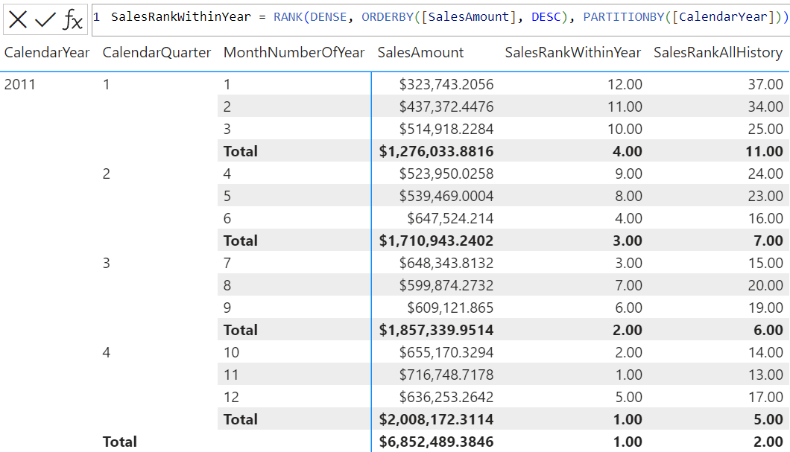

# RANK

Returns the ranking for the current context within the specified partition, sorted by the specified order. If a match cannot be found then then rank is blank.
  
## Syntax  
  
```dax
RANK ( [<ties>][, <relation> or <axis>][, <orderBy>][, <blanks>][, <partitionBy>][, <matchBy>][, <reset>] )
```
  
### Parameters  
  
|Term|Definition|  
|--------|--------------|  
|ties|(Optional) Defines how to handle the ranking when two or more rows are tied. </br>If specified, the supported value is either DENSE, or SKIP. </br>If omitted:</br>- Defaults to SKIP |
|relation|(Optional) A table expression from which the output row is returned. </br>If specified, all columns in \<orderBy> and \<partitionBy> must come from it. </br>If omitted: </br>- \<orderBy> must be explicitly specified.</br>- All \<orderBy> and \<partitionBy> columns must be fully qualified and come from a single table. </br>- Defaults to ALLSELECTED() of all columns in \<orderBy> and \<partitionBy>.|
|axis|(Optional) An axis in the visual shape. Available in visual calculations only, and replaces \<relation>.
|orderBy|(Optional) An ORDERBY() clause containing the columns that define how each partition is sorted. </br>If omitted: </br>- \<relation> must be explicitly specified. </br>- Defaults to ordering by every column in \<relation> that is not already specified in \<partitionBy>.|
|blanks|(Optional) An enumeration that defines how to handle blank values when sorting. </br>The supported values are:<ul><li>KEEP (the default value), where the behavior for numerical values is blank values are ordered between zero and negative values. The behavior for strings is blank values are ordered before all strings, including empty strings.</li><li>FIRST, blanks are always ordered on the beginning, regardless of ascending or descending sorting order.</li><li>LAST, blanks are always ordered on the end, regardless of ascending or descending sorting order. </li></ul></br>Note, when \<blanks> parameter and blanks in ORDERBY() function on individual expression are both specified, \<blanks> on individual orderBy expression takes priority for the relevant orderBy expression, and orderBy expressions without \<blanks> being specified will honor \<blanks> parameter on parent Window function.|
|partitionBy|(Optional) A PARTITIONBY() clause containing the columns that define how \<relation> is partitioned. </br> If omitted, \<relation> is treated as a single partition. |
|matchBy|(Optional) A MATCHBY() clause containing the columns that define how to match data and identify the current row. |
|reset|(Optional) Available in visual calculations only. Indicates if the calculation resets, and at which level of the visual shape's column hierarchy. Accepted values are: NONE, LOWESTPARENT, HIGHESTPARENT, or an integer. The behavior depends on the integer sign: </br> - If zero or omitted, the calculation does not reset. Equivalent to NONE. </br> - If positive, the integer identifies the column starting from the highest, independent of grain. HIGHESTPARENT is equivalent to 1. </br> - If negative, the integer identifies the column starting from the lowest, relative to the current grain. LOWESTPARENT is equivalent to -1. |
  
## Return value

The rank number for the current context.
  
## Remarks

- Each \<orderBy>, \<partitionBy>, and \<matchBy> column must have a corresponding outer value to help define the current row on which to operate, with the following behavior:

  - If there is exactly one corresponding outer column, its value is used.
  - If there is no corresponding outer column, then:
    - RANK will first determine all \<orderBy>, \<partitionBy>, and \<matchBy> columns that have no corresponding outer column.
    - For every combination of existing values for these columns in RANK parent context, RANK is evaluated and a row is returned.
    - RANK’s final output is a rank number.
- If \<matchBy> is present, then RANK will try to use columns in \<matchBy> and \<partitionBy> to idenfity the current row.
- If the columns specified within \<orderBy> and \<partitionBy> cannot uniquely identify every row in \<relation>, then two or more rows may have the same ranking and the ranking will be determined by the ties parameter.
- RANK returns a blank value for total rows. It's recommended that you test your expression thoroughly.
- RANK does not compare to RANKX as SUM compares to SUMX.
- \<reset> can be used in visual calculations only, and cannot be used in combination with \<orderBy> or \<partitionBy>. If \<reset> is present, \<axis> can be specified but \<relation> cannot.

## Example 1 - calculated column

The following DAX query:
  
```dax
EVALUATE
ADDCOLUMNS(
    'DimGeography',
    "Rank",
    RANK(
    	DENSE,
    	'DimGeography',
    	ORDERBY(
    		'DimGeography'[StateProvinceName], desc,
    		'DimGeography'[City], asc),
        LAST,
    	PARTITIONBY(
    		'DimGeography'[EnglishCountryRegionName])))
ORDER BY [EnglishCountryRegionName] asc, [StateProvinceName] desc, [City] asc
```

Returns a table that ranks each geography with the same EnglishCountryRegionName, by their StateProvinceName and City. Blank \<orderBy> column values are sorted on the end. 

## Example 2 - visual calculation

The following visual calculation DAX queries:

```dax
SalesRankWithinYear = RANK(DENSE, ORDERBY([SalesAmount], DESC), PARTITIONBY([CalendarYear]))

SalesRankAllHistory = RANK(DENSE, ORDERBY([SalesAmount], DESC))
```

Create two columns that rank each month by the total sales, both within each year, and the entire history.

The screenshot below shows the visual matrix and the first visual calculation expression:



## Related content

[INDEX](index-function-dax.md)  
[ORDERBY](orderby-function-dax.md)  
[PARTITIONBY](partitionby-function-dax.md)  
[WINDOW](window-function-dax.md)  
[ROWNUMBER](rownumber-function-dax.md)
