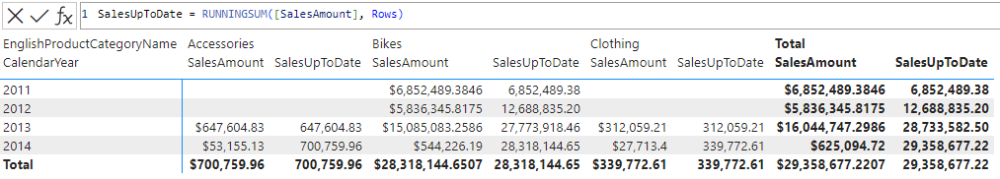

# RUNNINGSUM

[!INCLUDE[applies-to-visual-calculations](includes/applies-to-visual-calculations.md)]

Returns a running sum calculated along the given axis of the visual matrix. That is, the sum of the given column calculated over all elements up to the current element of an axis.

## Syntax

```dax
RUNNINGSUM ( <column>[, <axis>][, <blanks>][, <reset>] )
```

### Parameters

|Term|Definition|
|--------|--------------|
|`column`|The column that provides the value for each element.|
|`axis`|(Optional) An axis reference, the direction along which the running sum will be calculated.|
|`blanks`|(Optional) An enumeration that defines how to handle blank values when sorting. </br>The supported values are:<ul><li>`DEFAULT` (the default value), where the behavior for numerical values is blank values are ordered between zero and negative values. The behavior for strings is blank values are ordered before all strings, including empty strings.</li><li>`FIRST`, blanks are always ordered on the beginning, regardless of ascending or descending sorting order.</li><li>`LAST`, blanks are always ordered on the end, regardless of ascending or descending sorting order. </li></ul>|
|`reset`|(Optional) Indicates if the calculation resets, and at which level of the visual shape's column hierarchy. Accepted values are: `NONE`, `LOWESTPARENT`, `HIGHESTPARENT`, or an integer. The behavior depends on the integer sign: </br> - If zero or omitted, the calculation does not reset. Equivalent to `NONE`. </br> - If positive, the integer identifies the column starting from the highest, independent of grain. `HIGHESTPARENT` is equivalent to 1. </br> - If negative, the integer identifies the column starting from the lowest, relative to the current grain. `LOWESTPARENT` is equivalent to -1. |

## Return value

A scalar value, the running sum up to the current element of the axis.

## Remarks

This function can be used in visual calculations only.

The `axis`, `blanks` and `reset` parameters can be omitted.

## Example

Given a table that summarizes the total sales for each product category and calendar year, the following DAX query adds a column with the total sales for that category up to a given year.

```dax
SalesUpToDate = RUNNINGSUM([SalesAmount], Rows)
```

The screenshot below shows the visual matrix and the visual calculation expression:



## See also

[INDEX](index-function-dax.md)
[MOVINGAVERAGE](movingaverage-function-dax.md)
[ORDERBY](orderby-function-dax.md)
[PARTITIONBY](partitionby-function-dax.md)
[WINDOW](window-function-dax.md)
