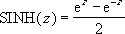

# SINH Function (DAX)
Returns the hyperbolic sine of a number.  
  
## Syntax  
  
```  
SINH(number)  
```  
  
#### Parameters  
  
|Term|Definition|  
|--------|--------------|  
|number|Required. Any real number.|  
  
## Return Value  
Returns the hyperbolic sine of a number.  
  
## Remarks  
The formula for the hyperbolic sine is:  
  
  
  
## Example  
  
|Formula|Description|Result|  
|-----------|---------------|----------|  
|=2.868*SINH(0.0342\*1.03)|Probability of obtaining a result of less than 1.03 seconds.|0.1010491|  
  
