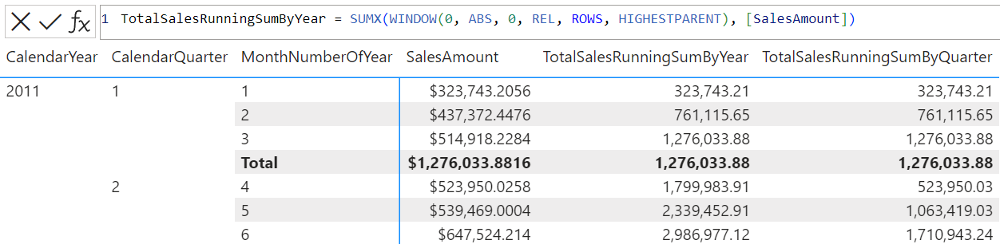

# WINDOW

[!INCLUDE[applies-to-measures-columns-tables-visual-calculations](includes/applies-to-measures-columns-tables-visual-calculations.md)]

Returns multiple rows which are positioned within the given interval.

## Syntax

```dax
WINDOW ( from[, from_type], to[, to_type][, <relation> or <axis>][, <orderBy>][, <blanks>][, <partitionBy>][, <matchBy>][, <reset>] )
```

### Parameters

|Term|Definition|
|--------|--------------|
|`from`|Indicates where the window starts. It can be any DAX expression that returns a scalar value. </br>The behavior depends on the `from_type` parameter: </br> - If `from_type` is REL, the number of rows to go back (negative value) or forward (positive value) from the current row to get the first row in the window. </br> - If `from_type` is ABS, and `from` is positive, then it’s the position of the start of the window from beginning of the partition. Indexing is 1-based and 0 is interpreted as 1. For example, 0 and 1 mean the window starts from the beginning of the partition. If `from` is negative, then it’s the position of the start of the window from the end of the partition. -1 means the last row in the partition. |
|`from_type` |Modifies behavior of the `from` parameter. Possible values are ABS (absolute) and REL (relative). Default is REL.|
|`to`|Same as `from`, but indicates the end of the window. The last row is included in the window.|
|`to_type`|Same as `from_type`, but modifies the behavior of `to`.|
|`relation`|(Optional) A table expression from which the output rows are returned. If used in visual calculations, this parameter accepts an axis in the visual shape. </br>If specified, all columns in `partitionBy` must come from it or a related table. </br>If omitted: </br>- `orderBy` must be explicitly specified.</br>- All `orderBy` and `partitionBy` expressions must be fully qualified column names and come from a single table. </br>- Defaults to ALLSELECTED() of all columns in `orderBy` and `partitionBy`.|
|`orderBy`|(Optional) An ORDERBY() clause containing the expressions that define how each partition is sorted. </br>If omitted: </br>- `relation` must be explicitly specified. </br>- Defaults to ordering by every column in `relation` that is not already specified in `partitionBy`.|
|`blanks`|(Optional) An enumeration that defines how to handle blank values when sorting the `relation` or `axis`. </br>The supported values are:<ul><li>`DEFAULT` (the default value), where the behavior for numerical values is blank values are ordered between zero and negative values. The behavior for strings is blank values are ordered before all strings, including empty strings.</li><li>`FIRST`, blanks are always ordered on the beginning, regardless of ascending or descending sorting order.</li><li>`LAST`, blanks are always ordered on the end, regardless of ascending or descending sorting order. </li></ul></br>Note, when the `blanks` parameter and blanks in the [ORDERBY()](orderby-function-dax.md) function on individual expressions are both specified, `blanks` on individual orderBy expression takes priority for the relevant orderBy expression, and orderBy expressions without `blanks` being specified will honor the `blanks` parameter on the parent function.|
|`partitionBy`|(Optional) A [PARTITIONBY()](partitionby-function-dax.md) clause containing the columns that define how `relation` is partitioned. If omitted, `relation` is treated as a single partition.|
|`matchBy`|(Optional) A [MATCHBY()](matchby-function-dax.md) clause containing the columns that define how to match data and identify the current row.|
|`reset`|(Optional) Available in visual calculations only. Indicates if the calculation resets, and at which level of the visual shape's column hierarchy. Accepted values are: a field reference to a column in the current visual shape, `NONE` (default), `LOWESTPARENT`, `HIGHESTPARENT`, or an integer. The behavior depends on the integer sign: </br> - If zero or omitted, the calculation does not reset. Equivalent to `NONE`. </br> - If positive, the integer identifies the column starting from the highest, independent of grain. `HIGHESTPARENT` is equivalent to 1. </br> - If negative, the integer identifies the column starting from the lowest, relative to the current grain. `LOWESTPARENT` is equivalent to -1.|

## Return value

All rows from the window.

## Remarks
Except for columns added by DAX table functions, each column in `relation`, when `matchBy` is not present, or each column in `matchBy` and `partitionBy`, when `matchBy` is present, must have a corresponding outer value to help define the current row on which to operate. If `from_type` and `to_type` both have value ABS, then the following applies only to the `partitionBy` columns:

- If there is exactly one corresponding outer column, its value is used.
- If there is no corresponding outer column:
  - WINDOW will first determine all columns that have no corresponding outer column.
  - For every combination of existing values for these columns in WINDOW’s parent context, WINDOW is evaluated, and the corresponding rows is returned.
  - WINDOW final output is a union of these rows. 
- If there is more than one corresponding outer column, an error is returned.

If all of `relation`'s columns were added by DAX table functions, an error is returned.

If `matchBy` is present, WINDOW will try to use `matchBy` and `partitionBy` columns to identify the row. 
If `matchBy` is not present and the columns specified within `orderBy` and `partitionBy` cannot uniquely identify every row in `relation`, then:

- WINDOW will try to find the least number of additional columns required to uniquely identify every row.
- If such columns can be found, WINDOW will automatically append these new columns to `orderBy`, and each partition is sorted using this new set of orderBy columns.
- If such columns cannot be found, an error is returned.

An empty table is returned if:

- The corresponding outer value of an `orderBy` or `partitionBy` column does not exist within `relation`.
- The whole window is outside the partition, or the beginning of the window is after its ending.

If WINDOW is used within a calculated column defined on the same table as `relation`, and `orderBy` is omitted, an error is returned.

If the beginning of the window turns out be before the first row, then it’s set to the first row. Similarly, if the end of the window is after the last row of the partition, then it's set to the last row.

`reset` can be used in visual calculations only, and cannot be used in combination with `orderBy` or `partitionBy`. If `reset` is present, `axis` can be specified but `relation` cannot.

If the value of `reset` is absolute (i.e., a positive integer, `HIGHESTPARENT` or a field reference) and the calculation is evaluated at or above the target level in the hierarchy, the calculation resets for each individual element. That is, the function is evaluated within a partition containing only that specific element.

## Example 1 - measure

The following measure:

```dax
3-day Average Price = 
AVERAGEX(
    WINDOW(
        -2,REL,0,REL,
        SUMMARIZE(ALLSELECTED('Sales'), 'Date'[Date], 'Product'[Product]),
        ORDERBY('Date'[Date]),
        KEEP,
        PARTITIONBY('Product'[Product])
    ), 
    CALCULATE(AVERAGE(Sales[Unit Price]))
)

```

Returns the 3-day average of unit prices for each product. Note the 3-day window consists of three days in which the product has sales, not necessarily three consecutive calendar days.

## Example 2 - measure

The following measure:

```dax
RunningSum =
SUMX (
    WINDOW (
        1, ABS, 0, REL,
        ALLSELECTED (
            'Date'[Fiscal Year],
            'Date'[Month Number Of Year]
        ),
        PARTITIONBY ( 'Date'[Fiscal Year] )
    ),
    [Total Sales]
)

```

Returns the running sum for Total Sales by Month Number Of Year, restarting for every Fiscal Year:

| Year   | Month Number Of Year | Sales Amount | RunningSum   |
|--------|----------------------|--------------|--------------|
| FY2018 | 1                    | $1,327,675   | $1,327,675   |
| FY2018 | 2                    | $3,936,463   | $5,264,138   |
| FY2018 | 3                    | $700,873     | $5,965,011   |
| FY2018 | 4                    | $1,519,275   | $7,484,286   |
| FY2018 | 5                    | $2,960,378   | $10,444,664  |
| FY2018 | 6                    | $1,487,671   | $11,932,336  |
| FY2018 | 7                    | $1,423,357   | $13,355,693  |
| FY2018 | 8                    | $2,057,902   | $15,413,595  |
| FY2018 | 9                    | $2,523,948   | $17,937,543  |
| FY2018 | 10                   | $561,681     | $18,499,224  |
| FY2018 | 11                   | $4,764,920   | $23,264,145  |
| FY2018 | 12                   | $596,747     | $23,860,891  |
| FY2019 | 1                    | $1,847,692   | $1,847,692   |
| FY2019 | 2                    | $2,829,362   | $4,677,054   |
| FY2019 | 3                    | $2,092,434   | $6,769,488   |
| FY2019 | 4                    | $2,405,971   | $9,175,459   |
| FY2019 | 5                    | $3,459,444   | $12,634,903  |
| FY2019 | 6                    | $2,850,649   | $15,485,552  |
| FY2019 | 7                    | $2,939,691   | $18,425,243  |
| FY2019 | 8                    | $3,964,801   | $22,390,045  |
| FY2019 | 9                    | $3,287,606   | $25,677,650  |
| FY2019 | 10                   | $2,157,287   | $27,834,938  |
| FY2019 | 11                   | $3,611,092   | $31,446,030  |
| FY2019 | 12                   | $2,624,078   | $34,070,109  |
| FY2020 | 1                    | $3,235,187   | $3,235,187   |
| FY2020 | 2                    | $4,070,046   | $7,305,233   |
| FY2020 | 3                    | $4,429,833   | $11,735,066  |
| FY2020 | 4                    | $4,002,614   | $15,737,680  |
| FY2020 | 5                    | $5,265,797   | $21,003,477  |
| FY2020 | 6                    | $3,465,241   | $24,468,717  |
| FY2020 | 7                    | $3,513,064   | $27,981,781  |
| FY2020 | 8                    | $5,247,165   | $33,228,947  |
| FY2020 | 9                    | $5,104,088   | $38,333,035  |
| FY2020 | 10                   | $3,542,150   | $41,875,184  |
| FY2020 | 11                   | $5,151,897   | $47,027,081  |
| FY2020 | 12                   | $4,851,194   | $51,878,275  |

## Example 3 - visual calculation

The following visual calculation DAX query:

```dax
TotalSalesRunningSumByYear = SUMX(WINDOW(0, ABS, 0, REL, ROWS, HIGHESTPARENT), [SalesAmount])
```

Returns the cumulative total sales by month, calculated along each year. The value 1 could be used instead of `HIGHESTPARENT`, with the same result.

The screenshot below shows the visual matrix and the visual calculation expression:



## Example 4 - visual calculation

The following visual calculation DAX query:

```dax
TotalSalesRunningSumByQuarter = SUMX(WINDOW(0, ABS, 0, REL, , -1), [SalesAmount])
```

Returns the cumulative total sales by month, calculated along each quarter.
The value `LOWESTPARENT` could be used instead of -1, with the same result.

## Related content

[INDEX](index-function-dax.md)
[MOVINGAVERAGE](movingaverage-function-dax.md)
[OFFSET](offset-function-dax.md)
[ORDERBY](orderby-function-dax.md)
[PARTITIONBY](partitionby-function-dax.md)
[RANGE](range-function-dax.md)
[RANK](rank-function-dax.md)
[ROWNUMBER](rownumber-function-dax.md)
[RUNNINGSUM](runningsum-function-dax.md)
