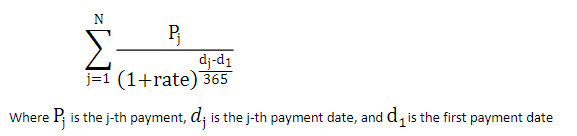

# XIRR Function (DAX)
  
Returns the internal rate of return for a schedule of cash flows that is not necessarily periodic.  
  
## Syntax  
  
```  
XIRR(<table>, <values>, <dates>, [guess])  
```  
  
#### Parameters  
  
|Term|Definition|  
|--------|--------------|  
|table|A table for which the values and dates expressions should be calculated.|  
|values|An expression that returns the cash flow value for each row of the table.|  
|dates|An expression that returns the cash flow date for each row of the table.|  
|guess|(Optional) An initial guess for the internal rate of return. If omitted, the default guess of 0.1 is used.|  
  
## Return Value  
Internal rate of return for the given inputs. If the calculation fails to return a valid result, an error is returned.  
  
## Remarks  
The value is calculated as the rate that satisfies the following function:  
  
  
  
The series of cash flow values must contain at least one positive number and one negative number.  
  
## Example  
The following calculates the internal rate of return of the CashFlows table:  
  
```  
Rate of return := XIRR( CashFlows, [Payment], [Date] )  
```  
  
|Date|Payment|  
|--------|-----------|  
|1/1/2014|-10000|  
|3/1/2014|2750|  
|10/30/2014|4250|  
|2/15/2015|3250|  
|4/1/2015|2750|  
  
Rate of return = 37.49%  
  
