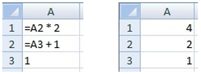

# Introduction

## Overview 

Microsoft Power Query provides a powerful "get data" experience that encompasses many features. A core capability of Power Query is to filter and combine, that is, to "mash-up" data from one or more of a rich collection of supported data sources. Any such data mashup is expressed using the Power Query Formula Language (informally known as "M"). Power Query embeds M documents in Excel and Power BI workbooks to enable repeatable mashup of data.

This document provides the specification for M. After a brief introduction that aims at building some first intuition and familiarity with the language, the document covers the language precisely in several progressive steps:
 
1. The _lexical structure_ defines the set of texts that are lexically valid.

2. Values, expressions, environments and variables, identifiers, and the evaluation model form the language's _basic concepts_.

3. The detailed specification of _values_, both primitive and structured, defines the target domain of the language.

4. Values have _types_, themselves a special kind of value, that both characterize the fundamental kinds of values and carry additional metadata that is specific to the shapes of structured values.

5. The set of _operators_ in M defines what kinds of expressions can be formed.

6. _Functions_, another kind of special values, provide the foundation for a rich standard library for M and allow for the addition of new abstractions.

7. _Errors_ can occur when applying operators or functions during expression evaluation. While errors are not values, there are ways to _handle errors_ that map errors back to values.

8. _Let expressions_ allow for the introduction of auxiliary definitions used to build up complex expressions in smaller steps.

9. _If expressions_ support conditional evaluation.

10. _Sections_ provide a simple modularity mechanism. (Sections are not yet leveraged by Power Query.)

11. Finally, a _consolidated grammar_ collects the grammar fragments from all other sections of this document into a single complete definition.
 
For computer language theorists: the formula language specified in this document is a mostly pure, higher-order, dynamically typed, partially lazy functional language.

## Expressions and values

The central construct in M is the _expression_. An expression can be evaluated (computed), yielding a single _value_.

Although many values can be written literally as an expression, a value is not an expression. For example, the expression `1` evaluates to the value _1_; the expressions `1+1` evaluates to the value _2_. This distinction is subtle, but important. Expressions are recipes for evaluation; values are the results of evaluation.

The following examples illustrate the different kinds of values available in M. As a convention, a value is written using the literal form in which they would appear in an expression that evaluates to just that value. (Note that the `//` indicates the start of a comment which continues to the end of the line.)

* A _primitive_ value is single-part value, such as a number, logical, text, or null. A null value can be used to indicate the absence of any data.

   ```
   123                  // A number
   true                 // A logical
   "abc"                // A text
   null                 // null value
   ```

* A _list_ value is an ordered sequence of values. M supports infinite lists, but if written as a literal, lists have a fixed length. The curly brace characters `{` and `}` denote the beginning and end of a list.

   ```
   {123, true, "A"}     // list containing a number, a logical, and 
                        //     a text 
   {1, 2, 3}            // list of three numbers 
   ```

* A _record_ is a set of _fields_. A field is a name/value pair where the name is a text value that is unique within the field's record. The literal syntax for record values allows the names to be written without quotes, a form also referred to as _identifiers_. The following shows a record containing three fields named "`A`", "`B`", and "`C`", which have values `1`, `2`, and `3`.

   ```
   [ 
        A = 1,  
        B = 2,  
        C = 3 
   ]
   ```
* A _table_ is a set of values organized into columns (which are identified by name), and rows. There is no literal syntax for creating a table, but there are several standard functions that can be used to create tables from lists or records.

   For example:

   ```
   #table( {"A", "B"}, { {1, 2}, {3, 4} } ) 
   ```

   This creates a table of the following shape: 
 
   | | |
   | --- | --- |
   | A | B |
   | 1 | 2 |
   | 3 | 4 |
   | | |
 
* A _function_ is a value which, when invoked with arguments, produces a new value. Function are written by listing the function's _parameters_ in parentheses, followed by the goes-to symbol `=>`, followed by the expression defining the function. That expression typically refers to the parameters (by name).

   ```
   (x, y) => (x + y) / 2`
   ```

## Evaluation

The evaluation model of the M language is modeled after the evaluation model commonly found in spreadsheets, where the order of calculation can be determined based on dependencies between the formulas in the cells.

If you have written formulas in a spreadsheet such as Excel, you may recognize the formulas on the left will result in the values on the right when calculated:


       
In M, parts of an expression can reference other parts of the expression by name, and the evaluation process will automatically determine the order in which referenced expressions are calculated.

We can use a record to produce an expression which is equivalent to the above spreadsheet example. When initializing the value of a field, we can refer to other fields within the record by using the name of the field, as follows:

```
[  
    A1 = A2 * 2,  
    A2 = A3 + 1,  
    A3 = 1  
]
```

The above expression is equivalent to the following (in that both evaluate to equal values):

```
[  
    A1 = 4,  
    A2 = 2,  
    A3 = 1  
]
```

Records can be contained within, or _nest_, within other records. We can use the _lookup operator_ (`[]`) to access the fields of a record by name. For example, the following record has a field named `Sales` containing a record, and a field named `Total` that accesses the `FirstHalf` and `SecondHalf` fields of the `Sales` record:

```
[  
    Sales = [ FirstHalf = 1000, SecondHalf = 1100 ], 
    Total = Sales[FirstHalf] + Sales[SecondHalf] 
]
```

The above expression is equivalent to the following when it is evaluated: \

```
[  
    Sales = [ FirstHalf = 1000, SecondHalf = 1100 ], 
    Total = 2100 
]
```

Records can also be contained within lists. We can use the _positional index operator_ (`{}`) to access an item in a list by its numeric index. The values within a list are referred to using a zero-based index from the beginning of the list. For example, the indexes `0` and `1` are used to reference the first and second items in the list below:

```
[ 
    Sales =  
        {  
            [  
                Year = 2007,  
                FirstHalf = 1000,  
                SecondHalf = 1100, 
                Total = FirstHalf + SecondHalf // 2100 
            ], 
            [  
                Year = 2008,  
                FirstHalf = 1200,  
                SecondHalf = 1300, 
                Total = FirstHalf + SecondHalf // 2500 
            ]  
        }, 
    TotalSales = Sales{0}[Total] + Sales{1}[Total] // 4600 
]
```

List and record member expressions (as well as let expressions, introduced further below) are evaluated using _lazy evaluation_, which means that they are evaluated only as needed. All other expressions are evaluated using _eager evaluation_, which means that they are evaluated immediately, when encountered during the evaluation process. A good way to think about this is to remember that evaluating a list or record expression will return a list or 
record value that itself remembers how its list items or record fields need to be computed, when requested (by lookup or index operators).

## Functions

In M, a _function_ is a mapping from a set of input values to a single output value. A function is written by first naming the required set of input values (the parameters to the function) and then providing an expression that will compute the result of the function using those input values (the body of the function) following the goes-to (`=>`) symbol. For example:

```
(x) => x + 1                    // function that adds one to a value 
(x, y) =>  x + y                // function that adds two values
```

A function is a value just like a number or a text value. The following example shows a function which is the value of an Add field which is then _invoked_, or executed, from several other fields. When a function is invoked, a set of values are specified which are logically substituted for the required set of input values within the function body expression.

```
[ 
    Add = (x, y) => x + y,
    OnePlusOne = Add(1, 1),     // 2 
    OnePlusTwo = Add(1, 2)      // 3
]
```

## Library

M includes a common set of definitions available for use from an expression called the _standard library_, or just library for short. These definitions consist of a set of named values. The names of values provided by a library are available for use within an expression without having been defined explicitly by the expression. For example:

```
Number.E                        // Euler's number e (2.7182...) 
Text.PositionOf("Hello", "ll")  // 2
```

## Operators

M includes a set of operators that can be used in expressions. _Operators_ are applied to _operands_ to form symbolic expressions. For example, in the expression `1 + 2` the numbers `1` and `2` are operands and the operator is the addition operator (`+`).

The meaning of an operator can vary depending on what kind of values its operands are. For example, the plus operator can be used with other kinds of values than numbers:

```
1 + 2                   // numeric addition: 3 
#time(12,23,0) + #duration(0,0,2,0) 
                        // time arithmetic: #time(12,25,0)
```

Another example of an operator with operand-depending meaning is the combination operator (`&`):

```
"A" & "BC"              // text concatenation: "ABC" 
{1} & {2, 3}            // list concatenation: {1, 2, 3} 
[ a = 1 ] & [ b = 2 ]   // record merge: [ a = 1, b = 2 ]
```

Note that not all combinations of values may be supported by an operator. For example:

```
1 + "2"  // error: adding number and text is not supported
```

Expressions that, when evaluated, encounter undefined operator conditions evaluate to errors. More on errors in M later.

## Metadata

_Metadata_ is information about a value that is associated with a value. Metadata is represented as a record value, called a _metadata record_. The fields of a metadata record can be used to store the metadata for a value.

Every value has a metadata record. If the value of the metadata record has not been specified, then the metadata record is empty (has no fields).

Metadata records provide a way to associate additional information with any kind of value in an unobtrusive way. Associating a metadata record with a value does not change the value or its behavior.

A metadata record value `y` is associated with an existing value `x` using the syntax `x meta y`. For example, the following associates a metadata record with `Rating` and `Tags` fields with the text value `"Mozart"`:

```
"Mozart" meta [ Rating = 5, Tags = {"Classical"} ]
```

For values that already carry a non-empty metadata record, the result of applying meta is that of computing the record merge of the existing and the new metadata record. For example, the following two expressions are equivalent to each other and to the previous expression:

```
("Mozart" meta [ Rating = 5 ]) meta [ Tags = {"Classical"} ] 
"Mozart" meta ([ Rating = 5 ] & [ Tags = {"Classical"} ])
```

A metadata record can be accessed for a given value using the _Value.Metadata_ function. In the following example, the expression in the `ComposerRating` field accesses the metadata record of the value in the `Composer` field, and then accesses the `Rating` field of the metadata record.

```
[ 
    Composer = "Mozart" meta [ Rating = 5, Tags = {"Classical"} ], 
    ComposerRating = Value.Metadata(Composer)[Rating] // 5
]
```

## Let expression

Many of the examples shown so far have included all the literal values of the expression in the result of the expression. The _let_ expression allows a set of values to be computed, assigned names, and then used in a subsequent expression that follows the _in_. For example, in our sales data example, we could do:

```
let 
    Sales2007 =  
        [  
            Year = 2007,  
            FirstHalf = 1000,  
            SecondHalf = 1100, 
            Total = FirstHalf + SecondHalf // 2100 
        ], 
    Sales2008 =  
        [  
            Year = 2008,  
            FirstHalf = 1200,  
            SecondHalf = 1300, 
            Total = FirstHalf + SecondHalf // 2500 
        ] 
  in Sales2007[Total] + Sales2008[Total] // 4600
```

The result of the above expression is a number value (`4600`) which was computed from the values bound to the names `Sales2007` and `Sales2008`.

## If expression

The `if` expression selects between two expressions based on a logical condition. For example:

```
if 2 > 1 then
    2 + 2
else  
    1 + 1
```

The first expression (`2 + 2`) is selected if the logical expression (`2 > 1`) is true, and the second expression (`1 + 1`) is selected if it is false. The selected expression (in this case `2 + 2`) is evaluated and becomes the result of the `if` expression (`4`).

## Errors

An _error_ is an indication that the process of evaluating an expression could not produce a value.

Errors are raised by operators and functions encountering error conditions or by using the error expression. Errors are handled using the try expression. When an error is raised, a value is specified that can be used to indicate why the error occurred.

```
let Sales = 
    [ 
        Revenue = 2000, 
        Units = 1000, 
        UnitPrice = if Units = 0 then error "No Units"
                    else Revenue / Units 
    ], 
    UnitPrice = try Number.ToText(Sales[UnitPrice])
in "Unit Price: " & 
    (if UnitPrice[HasError] then UnitPrice[Error][Message]
    else UnitPrice[Value])
```

The above example accesses the `Sales[UnitPrice]` field and formats the value producing the result:

```
"Unit Price: 2"
```

If the `Units` field had been zero, then the `UnitPrice` field would have raised an error which would have been handled by the `try`. The resulting value would then have been:

```
"No Units"
```

A `try` expression converts proper values and errors into a record value that indicates whether the try expression handled and error, or not, and either the proper value or the error record it extracted when handling the error. For example, consider the following expression that raises an error and then handles it right away:

```
try error "negative unit count"
```

This expression evaluates to the following nested record value, explaining the `[HasError]`, `[Error]`, and `[Message]` field lookups in the unit-price example before.

```
[ 
    HasError = true, 
    Error = 
        [ 
            Reason = "Expression.Error", 
            Message = "negative unit count", 
            Detail = null 
        ] 
]
```
A common case is to replace errors with default values. The `try` expression can be used with an optional `otherwise` clause to achieve just that in a compact form:

```
try error "negative unit count" otherwise 42 
// 42
```
