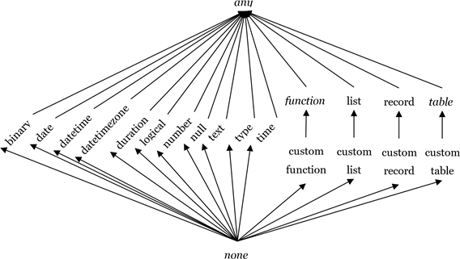

# Types

A _type value_ is a value that _classifies_ other values. A value that is classified by a type is said to _conform_ to that type. The M type system consists of the following kinds of types:

* Primitive types, which classify primitive values (`binary`, `date`, `datetime`, `datetimezone`, `duration`, `list`, `logical`, `null`, `number`, `record`, `text`, `time`, `type`) and also include a number of abstract types (`function`, `table`, `any`, `anynonnull` and `none`)

* Record types, which classify record values based on field names and value types

* List types, which classify lists using a single item base type

* Function types, which classify function values based on the types of their parameters and return values

* Table types, which classify table values based on column names, column types, and keys

* Nullable types, which classifies the value null in addition to all the values classified by a base type

* Type types, which classify values that are types

The set of _primitive types_ includes the types of primitive values, and a number of _abstract types_, which are types that do not uniquely classify any values: `function`, `table`, `any`, `anynonnull` and `none`. All function values conform to the abstract type `function`, all table values to the abstract type `table`, all values to the abstract type `any`, all non-null values to the abstract type `anynonnull`, and no values to the abstract type `none`. An expression of type `none` must raise an error or fail to terminate since no value could be produced that conforms to type `none`. Note that the primitive types `function` and `table` are abstract because no function or table is directly of those types, respectively. The primitive types `record` and `list` are non-abstract because they represent an open record with no defined fields and a list of type any, respectively.

All types that are not members of the closed set of primitive types plus their nullable counterparts are collectively referred to as _custom types_. Custom types can be written using a `type-expression`:

_type-expression:<br/>
&nbsp;&nbsp;&nbsp;&nbsp;&nbsp;&nbsp;primary-expression_<br/>
&nbsp;&nbsp;&nbsp;&nbsp;&nbsp;&nbsp;`type` _primary-type<br/> 
primary-type:<br/>
&nbsp;&nbsp;&nbsp;&nbsp;&nbsp;&nbsp;primitive-or-nullable-primitive-type<br/>
&nbsp;&nbsp;&nbsp;&nbsp;&nbsp;&nbsp;record-type<br/>
&nbsp;&nbsp;&nbsp;&nbsp;&nbsp;&nbsp;list-type<br/>
&nbsp;&nbsp;&nbsp;&nbsp;&nbsp;&nbsp;function-type<br/>
&nbsp;&nbsp;&nbsp;&nbsp;&nbsp;&nbsp;table-type<br/>
&nbsp;&nbsp;&nbsp;&nbsp;&nbsp;&nbsp;nullable-type_<br />
_primitive-or-nullable-primitive-type:_<br/>
&nbsp;&nbsp;&nbsp;&nbsp;&nbsp;&nbsp;`nullable`_<sub>opt</sub> primitive-type_<br />
_primitive-type:_ one of<br/>
&nbsp;&nbsp;&nbsp;&nbsp;&nbsp;&nbsp;`any anynonnull binary date datetime datetimezone duration function list logical`<br/>
&nbsp;&nbsp;&nbsp;&nbsp;&nbsp;&nbsp;`none null number record table text time type`<br/>

The _primitive-type_ names are _contextual keywords_ recognized only in a _type_ context. The use of parentheses in a _type_ context moves the grammar back to a regular expression context, requiring the use of the type keyword to move back into a type context. For example, to invoke a function in a _type_ context, parentheses can be used:

```powerquery-m
type nullable ( Type.ForList({type number}) )   
// type nullable {number}
```

Parentheses can also be used to access a variable whose name collides with a _primitive-type_ name:

```powerquery-m
let  record = type [ A = any ]  in  type {(record)} 
// type {[ A = any ]}
```

The following example defines a type that classifies a list of numbers:

```powerquery-m
type { number }
```

Similarly, the following example defines a custom type that classifies records with mandatory fields named `X` and `Y` whose values are numbers:

```powerquery-m
type [ X = number, Y = number ]
```

The ascribed type of a value is obtained using the standard library function [Value.Type](value-type.md), as shown in the following examples:

```powerquery-m
Value.Type( 2 )                 // type number 
Value.Type( {2} )               // type list 
Value.Type( [ X = 1, Y = 2 ] )  // type record
```

The `is` operator is used to determine whether a value's type is compatible with a given type, as shown in the following examples:

```powerquery-m
1 is number          // true 
1 is text            // false 
{2} is list          // true
```

The `as` operator checks if the value is compatible with the given type, and raises an error if it is not. Otherwise, it returns the original value.

```powerquery-m
Value.Type( 1 as number )   // type number 
{2} as text                 // error, type mismatch
```

Note that the `is` and `as` operators only accept a _primitive or nullable primitive type_ (i.e. a _non-custom type_) as their right operand. M does not provide means to check values for conformance to custom types.

A type `X` is _compatible_ with a type `Y` if and only if all values that conform to `X` also conform to `Y`. All types are compatible with type `any` and no types (but `none` itself) are compatible with type `none`. The following graph shows the compatibility relation. (Type compatibility is reflexive and transitive. It forms a lattice with type `any` as the top and type `none` as the bottom value.) The names of abstract types are set in _italics_. 



The following operators are defined for type values:

| Operator | Result |
| -------- | ------ |
| `x = y` | Equal |
| `x <> y` | Not equal |
| `x ?? y` | Coalesce |

The native type of type values is the intrinsic type `type`.

## Primitive Types

Types in the M language form a disjoint hierarchy rooted at type `any`, which is the type that classifies all values. Any M value conforms to exactly one primitive subtype of `any`. The closed set of primitive types deriving from type `any` are as follows:

* `type null`,  which classifies the null value.
* `type logical`, which classifies the values true and false.
* `type number`, which classifies number values.
* `type time`, which classifies time values.
* `type date`, which classifies date values.
* `type datetime`, which classifies datetime values.
* `type datetimezone`, which classifies datetimezone values.
* `type duration`, which classifies duration values.
* `type text`, which classifies text values.
* `type binary`, which classifies binary values.
* `type type`, which classifies type values.
* `type list`, which classifies list values.
* `type record`, which classifies record values.
* `type table`, which classifies table values.
* `type function`, which classifies function values.
* `type anynonnull`, which classifies all values excluding null.
* `type none`, which classifies no values.

## Any Type

The type `any` is abstract, classifies all values in M, and all types in M are compatible with `any`. Variables of type `any` can be bound to all possible values. Since `any` is abstract, it cannot be ascribed to values&mdash;that is, no value is directly of type `any`.

## List Types

Any value that is a list conforms to the intrinsic type `list`, which does not place any restrictions on the items within a list value.

_list-type:_<br/>
&nbsp;&nbsp;&nbsp;&nbsp;&nbsp;&nbsp;`{`  _item-type_  `}`<br/>
_item-type:<br/>
&nbsp;&nbsp;&nbsp;&nbsp;&nbsp;&nbsp;type_

The result of evaluating a _list-type_ is a _list type value_ whose base type is `list`.

The following examples illustrate the syntax for declaring homogeneous list types:

```powerquery-m
type { number }        // list of numbers type 
     { record }        // list of records type
     {{ text }}        // list of lists of text values
```

A value conforms to a list type if the value is a list and each item in that list value conforms to the list type's item type.

The item type of a list type indicates a bound: all items of a conforming list conform to the item type.

## Record Types

Any value that is a record conforms to the intrinsic type record, which does not place any restrictions on the field names or values within a record value. A _record-type value_ is used to restrict the set of valid names as well as the types of values that are permitted to be associated with those names.

_record-type:_<br/>
&nbsp;&nbsp;&nbsp;&nbsp;&nbsp;&nbsp;`[` _open-record-marker_  `]`<br/>
&nbsp;&nbsp;&nbsp;&nbsp;&nbsp;&nbsp;`[`  _field-specification-list<sub>opt</sub>_  `]`<br/>
&nbsp;&nbsp;&nbsp;&nbsp;&nbsp;&nbsp;`[`  _field-specification-list ,  open-record-marker_  `]`<br/>
_field-specification-list:</em><br/>
&nbsp;&nbsp;&nbsp;&nbsp;&nbsp;&nbsp;field-specification<br/>
&nbsp;&nbsp;&nbsp;&nbsp;&nbsp;&nbsp;field-specification_  `,`  _field-specification-list<br/> 
field-specification:_<br/>
&nbsp;&nbsp;&nbsp;&nbsp;&nbsp;&nbsp;`optional`_<sub>opt</sub> field-name field-type-specification<sub>opt</sub><br/>
field-type-specification:_<br/>
&nbsp;&nbsp;&nbsp;&nbsp;&nbsp;&nbsp;`=` _field-type<br/>
field-type:<br/>
&nbsp;&nbsp;&nbsp;&nbsp;&nbsp;&nbsp;type<br/>
open-record-marker:_<br/>
&nbsp;&nbsp;&nbsp;&nbsp;&nbsp;&nbsp;`...`

The result of evaluating a _record-type_ is a type value whose base type is `record`.

The following examples illustrate the syntax for declaring record types:

```powerquery-m
type [ X = number, Y = number] 
type [ Name = text, Age = number ]
type [ Title = text, optional Description = text ] 
type [ Name = text, ... ]
```

Record types are _closed_ by default, meaning that additional fields not present in the _fieldspecification-list_ are not allowed to be present in conforming values. Including the _openrecord-marker_ in the record type declares the type to be _open_, which permits fields not present in the field specification list. The following two expressions are equivalent:

```powerquery-m
type record   // primitive type classifying all records 
type [ ... ]  // custom type classifying all records
```

A value conforms to a record type if the value is a record and each field specification in the record type is satisfied. A field specification is satisfied if any of the following are true:

* A field name matching the specification's identifier exists in the record and the associated value conforms to the specification's type

* The specification is marked as optional and no corresponding field name is found in the record

A conforming value may contain field names not listed in the field specification list if and only if the record type is open.

## Function Types

Any function value conforms to the primitive type `function`, which does not place any restrictions on the types of the function's formal parameters or the function's return value. A custom _function-type value_ is used to place type restrictions on the signatures of conformant function values.

function-type:_<br/>
&nbsp;&nbsp;&nbsp;&nbsp;&nbsp;&nbsp;`function (`  _parameter-specification-list<sub>opt</sub>_  `)`  _return-type<br/>
parameter-specification-list:<br/>
&nbsp;&nbsp;&nbsp;&nbsp;&nbsp;&nbsp;required-parameter-specification-list<br/>
&nbsp;&nbsp;&nbsp;&nbsp;&nbsp;&nbsp;required-parameter-specification-list_  `,`  _optional-parameter-specification-list<br/>
&nbsp;&nbsp;&nbsp;&nbsp;&nbsp;&nbsp;optional-parameter-specification-list<br/>
required-parameter-specification-list:<br/>
&nbsp;&nbsp;&nbsp;&nbsp;&nbsp;&nbsp;required-parameter-specification<br/>
&nbsp;&nbsp;&nbsp;&nbsp;&nbsp;&nbsp;required-parameter-specification_  `,`  _required-parameter-specification-list<br/>
required-parameter-specification:<br/>
&nbsp;&nbsp;&nbsp;&nbsp;&nbsp;&nbsp;parameter-specification<br/>
optional-parameter-specification-list:<br/>
&nbsp;&nbsp;&nbsp;&nbsp;&nbsp;&nbsp;optional-parameter-specification<br/>
&nbsp;&nbsp;&nbsp;&nbsp;&nbsp;&nbsp;optional-parameter-specification_  `,`  _optional-parameter-specification-list<br/>
optional-parameter-specification:_<br/>
&nbsp;&nbsp;&nbsp;&nbsp;&nbsp;&nbsp;`optional` _parameter-specification<br/> 
parameter-specification:<br/>
&nbsp;&nbsp;&nbsp;&nbsp;&nbsp;&nbsp;parameter-name  parameter-type<br/>
parameter-type:<br/>
&nbsp;&nbsp;&nbsp;&nbsp;&nbsp;&nbsp;type-assertion<br/>
type-assertion:_<br/>
&nbsp;&nbsp;&nbsp;&nbsp;&nbsp;&nbsp;`as` _type_

The result of evaluating a _function-type_ is a type value whose base type is `function`.

The following examples illustrate the syntax for declaring function types:

```powerquery-m
type function (x as text) as number 
type function (y as number, optional z as text) as any
```

A function value conforms to a function type if the return type of the function value is compatible with the function type's return type and each parameter specification of the function type is compatible to the positionally corresponding formal parameter of the function. A parameter specification is compatible with a formal parameter if the specified _parameter-type_ type is compatible with the type of the formal parameter and the parameter specification is optional if the formal parameter is optional.

Formal parameter names are ignored for the purposes of determining function type conformance.

Specifying a parameter as optional implicitly makes its type nullable. The following create identical function types:

```powerquery-m
type function (optional x as text) as any
type function (optional x as nullable text) as any
```

## Table types

A _table-type value_ is used to define the structure of a table value.

_table-type:_<br/>
&nbsp;&nbsp;&nbsp;&nbsp;&nbsp;&nbsp;`table` _row-type<br/> 
row-type:_<br/>
&nbsp;&nbsp;&nbsp;&nbsp;&nbsp;&nbsp;`[`   _field-specification-list<sub>opt</sub>_  `]`

The result of evaluating a _table-type_ is a type value whose base type is `table`.

The _row type_ of a table specifies the column names and column types of the table as a closed record type. So that all table values conform to the type `table`, its row type is type `record` (the empty open record type). Thus, type table is abstract since no table value can have type `table`'s row type (but all table values have a row type that is compatible with type `table`'s row type). The following example shows the construction of a table type:

```powerquery-m
type table [A = text, B = number, C = binary] 
// a table type with three columns named A, B, and C 
// of column types text, number, and binary, respectively
```

A table-type value also carries the definition of a table value's _keys_. A key is a set of column names. At most one key can be designated as the table's _primary key_. (Within M, table keys have no semantic meaning. However, it is common for external data sources, such as databases or OData feeds, to define keys over tables. Power Query uses key information to improve performance of advanced functionality, such as cross-source join operations.)

The standard library functions `Type.TableKeys`, `Type.AddTableKey`, and `Type.ReplaceTableKeys` can be used to obtain the keys of a table type, add a key to a table type, and replace all keys of a table type, respectively.

```powerquery-m
Type.AddTableKey(tableType, {"A", "B"}, false) 
// add a non-primary key that combines values from columns A and B 
Type.ReplaceTableKeys(tableType, {}) 
// returns type value with all keys removed
```

## Nullable types

For any <code>type <em>T</em></code>, a nullable variant can be derived by using _nullable-type_:

_nullable-type:_<br/>
&nbsp;&nbsp;&nbsp;&nbsp;&nbsp;&nbsp;`nullable` _type_

The result is an abstract type that allows values of type _T_ or the value `null`.

```powerquery-m
42 is nullable number             // true null is
nullable number                   // true
```

Ascription of `type nullable` _T_ reduces to ascription of `type null` or `type` _T_. (Recall that nullable types are abstract and no value can be directly of abstract type.)

```powerquery-m
Value.Type(42 as nullable number)       // type number
Value.Type(null as nullable number)     // type null
```

The standard library functions `Type.IsNullable` and `Type.NonNullable` can be used to test a type for nullability and to remove nullability from a type.

The following hold (for any <code>type <em>T</em></code>):

* `type T` is compatible with `type nullable T`
* `Type.NonNullable(type T)` is compatible with `type T`

The following are pairwise equivalent (for any <code>type <em>T</em></code>):

&nbsp;&nbsp;&nbsp;&nbsp;`type nullable any`<br/>
&nbsp;&nbsp;&nbsp;&nbsp;`any`<br/>

&nbsp;&nbsp;&nbsp;&nbsp;`Type.NonNullable(type any)`<br/>
&nbsp;&nbsp;&nbsp;&nbsp;`type anynonnull`<br/>

&nbsp;&nbsp;&nbsp;&nbsp;`type nullable none`<br/>
&nbsp;&nbsp;&nbsp;&nbsp;`type null`<br/> 

&nbsp;&nbsp;&nbsp;&nbsp;`Type.NonNullable(type null)`<br/>
&nbsp;&nbsp;&nbsp;&nbsp;`type none`<br/>

&nbsp;&nbsp;&nbsp;&nbsp;<code>type nullable nullable <em>T</em></code><br/>
&nbsp;&nbsp;&nbsp;&nbsp;<code>type nullable <em>T</em></code><br/> 

&nbsp;&nbsp;&nbsp;&nbsp;<code>Type.NonNullable(Type.NonNullable(type <em>T</em>))</code><br/>
&nbsp;&nbsp;&nbsp;&nbsp;<code>Type.NonNullable(type <em>T</em>)</code><br/> 

&nbsp;&nbsp;&nbsp;&nbsp;<code>Type.NonNullable(type nullable <em>T</em>)</code><br/>
&nbsp;&nbsp;&nbsp;&nbsp;<code>Type.NonNullable(type <em>T</em>)</code><br/>

&nbsp;&nbsp;&nbsp;&nbsp;<code>type nullable (Type.NonNullable(type <em>T</em>))</code><br/>
&nbsp;&nbsp;&nbsp;&nbsp;<code>type nullable <em>T</em></code>

## Ascribed type of a value

A value's _ascribed type_ is the type to which a value is _declared_ to conform. 

A value may be ascribed a type using the library function `Value.ReplaceType`. This function either returns a new value with the type ascribed or raises an error if the new type is incompatible with the value.

When a value is ascribed a type, only a limited conformance check occurs:
* The type being ascribed must be non-abstract, non-nullable, and compatible with the value's intrinsic (native) _primitive-type_.
* When a custom type that defines structure is ascribed, it must match the structure of the value.
  * For records: The type must be closed, must define the same number of fields as the value, and must not contain any optional fields. (The type's field names and field types will replace those currently associated with the record. However, existing field values will not be checked against the new field types.)
  * For tables: The type must define the same number of columns as the value. (The type's column names and column types will replace those currently associated with the table. However, existing column values will not be checked against the new column types.)
  * For functions: The type must define the same number of required parameters, as well as the same number of optional parameters, as the value. (The type's parameter and return assertions, as well as its parameter names, will replace those associated with the function value's current type. However, the new assertions will have no effect on the actual behavior of the function.)
  * For lists: The value must be a list. (However, existing list items will not be checked against the new item type.)

Library functions may choose to compute and ascribe complex types to results based on the ascribed types of the input values.

The ascribed type of a value may be obtained using the library function `Value.Type`. For example:

```powerquery-m
Value.Type( Value.ReplaceType( {1}, type {number} ) 
// type {number}
```

## Type equivalence and compatibility

Type equivalence is not defined in M. An M implementation may optionally choose to use its own rules to perform equality comparisons between type values. Comparing two type values for equality should evaluate to `true` if they are considered identical by the implementation, and `false` otherwise. In either case, the response returned must be consistent if the same two values are repeatedly compared. Note that within a given implementation, comparing some identical type values (such as `(type text) = (type text)`) may return `true`, while comparing others (such as `(type [a = text]) = (type [a = text])`) may not.

Compatibility between a given type and either a primitive type or a nullable primitive type can be determined using the library function `Type.Is`, which accepts an arbitrary type value as its first argument and a primitive or nullable primitive type value as its second argument:

```powerquery-m
Type.Is(type text, type nullable text)  // true 
Type.Is(type nullable text, type text)  // false 
Type.Is(type number, type text)         // false 
Type.Is(type [a=any], type record)      // true 
Type.Is(type [a=any], type list)        // false
```

There is no support in M for determining compatibility of a given type with a custom type.

The standard library does include a collection of functions to extract the defining characteristics from a custom type, so specific compatibility tests can be implemented as M expressions. Below are some examples; consult the M library specification for full details.

```powerquery-m
Type.ListItem( type {number} ) 
  // type number 
Type.NonNullable( type nullable text ) 
  // type text 
Type.RecordFields( type [A=text, B=time] ) 
  // [ A = [Type = type text, Optional = false], 
  //   B = [Type = type time, Optional = false] ] 
Type.TableRow( type table [X=number, Y=date] ) 
  // type [X = number, Y = date] 
Type.FunctionParameters(
        type function (x as number, optional y as text) as number) 
  // [ x = type number, y = type nullable text ] 
Type.FunctionRequiredParameters(
        type function (x as number, optional y as text) as number) 
  // 1 
Type.FunctionReturn(
        type function (x as number, optional y as text) as number) 
  // type number 
```

## Related content

* [Types and type conversion](type-conversion.md)
* [Types in the Power Query M formula language](power-query-m-type-system.md)
