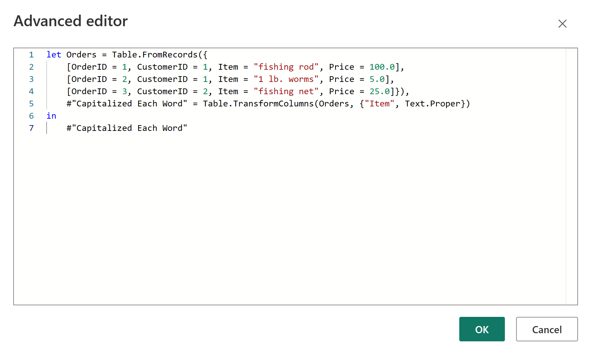

# Quick tour of the Power Query M formula language

This quick tour describes creating Power Query M formula language queries.  
  
> [!NOTE]  
> M is a case-sensitive language.  
  
## Create a query with Query Editor  

To create an advanced query, you use the **Query Editor**. A mashup query is composed of variables, expressions, and values encapsulated by a **let** expression. A variable can contain spaces by using the # identifier with the name in quotes as in #"Variable name".  
  
A **let** expression follows this structure:  
  
```powerquery-m
let  
   Variablename = expression,  
   #"Variable name" = expression2  
in   
   Variablename  
```  

To create an M query in the **Query Editor**, you follow this basic process:  
  
-   Create a series of query formula steps that start with the **let** statement. Each step is defined by a step variable name. An M **variable** can include spaces by using the # character as #"Step Name". A formula step can be a custom formula. Please note that the Power Query Formula Language is case sensitive.  
  
-   Each query formula step builds upon a previous step by referring to a step by its variable name.  
  
-   Output a query formula step using the **in** statement. Generally, the last query step is used as the in final data set result.  
  
  
To learn more about expressions and values, see [Expressions, values, and let expression](expressions-values-and-let-expression.md).  
  
## Simple Power Query M formula steps  

Let's assume you created the following transform in the **Query Editor** to convert product names to proper case.  
  
  
  
**You have a table that looks like this:**  
  
|OrderID|CustomerID|Item|Price|  
|-----------|--------------|--------|---------|  
|1|1|fishing rod|100|  
|2|1|1 lb. worms|5|  
|3|2|fishing net|25|  
  
**And, you want to capitalize each word in the Item column to produce the following table:**  
  
|OrderID|CustomerID|Item|Price|  
|-----------|--------------|--------|---------|  
|1|1|Fishing Rod|100|  
|2|1|1 Lb. Worms|5|  
|3|2|Fishing Net|25|  
  
**The M formula steps to project the original table into the results table looks like this:**  
  
  
  
Here's the code you can paste into **Query Editor**:  
  
```powerquery-m
let Orders = Table.FromRecords({  
    [OrderID = 1, CustomerID = 1, Item = "fishing rod", Price = 100.0],  
    [OrderID = 2, CustomerID = 1, Item = "1 lb. worms", Price = 5.0],  
    [OrderID = 3, CustomerID = 2, Item = "fishing net", Price = 25.0]}),  
    #"Capitalized Each Word" = Table.TransformColumns(Orders, {"Item", Text.Proper})  
in  
    #"Capitalized Each Word"  
```  

**Let’s review each formula step.**  
  
1.  **Orders** – Create a \[Table](#_Table_value) with data for Orders.  
  
2.  \#**"Capitalized Each Word"** – To capitalize each word, you use Table.TransformColumns().  
  
3.  **in #"Capitalized Each Word"** – Output the table with each word capitalized.  
  
## See also  

[Expressions, values, and let expression](expressions-values-and-let-expression.md)  
[Operators](operators.md)  
[Type conversion](type-conversion.md)  
  
